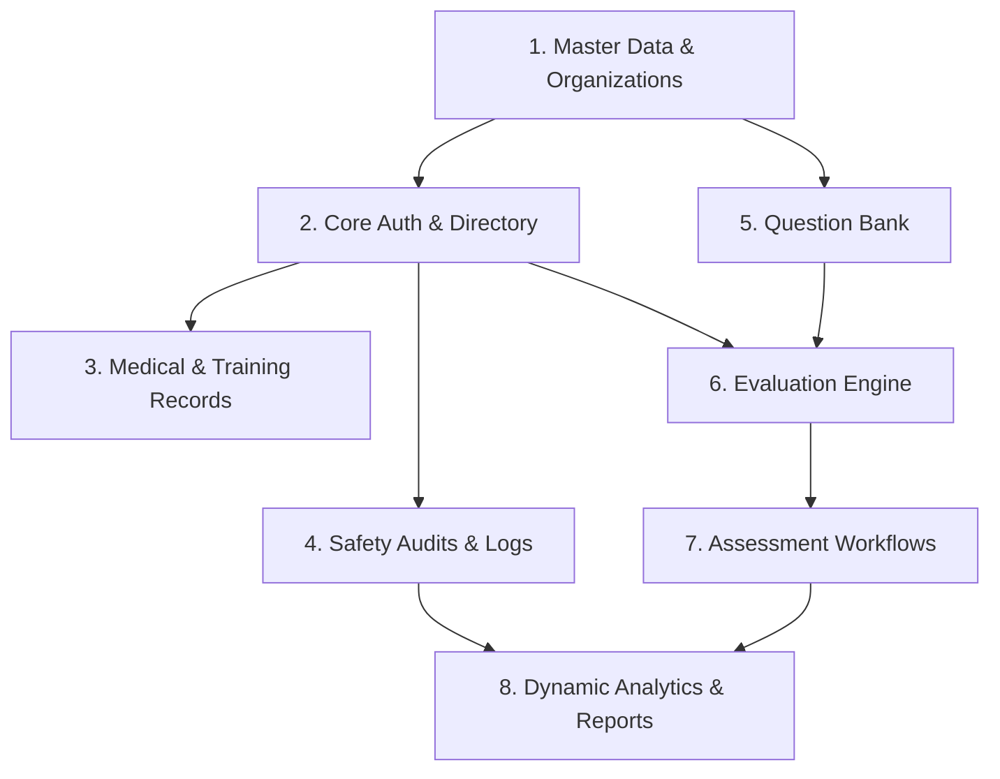

# 🚂 Indian Railway Staff Evaluation System (RSES)
## 🗺️ Backend Implementation Roadmap & Sequence

This document provides a highly structured, module-by-module implementation roadmap for the Supabase backend. It is designed to ensure the safest execution order, minimizing regressions and resolving dependencies linearly.

---

# 📊 1. MODULE DEPENDENCY DIAGRAM

The implementation must strictly follow this dependency graph. Building higher-level modules before their dependencies are resolved will cause referential integrity errors.

---

# 🚀 2. BACKEND IMPLEMENTATION SEQUENCE

## Module 1: Master Data & Organizations
*The bedrock of the system. All geographical and structural classifications rely on this.*

* **Dependencies:** None.
* **Database Tables Required:** `ROLE`, `DIVISION`, `STATION`.
* **Service Functions Required:** `getRoles()`, `getDivisions()`, `getStations(divisionId)`.
* **Security Requirements:** Read-only access for all authenticated users. Create/Update/Delete (CRUD) restricted strictly to `Super Admin`.
* **Testing Strategy:** Verify that inserting a `STATION` with a non-existent `division_id` fails (Foreign Key constraint test). Verify RLS blocks unauthorized station additions.

---

## Module 2: Core Auth & Personnel Directory
*Manages credentials and base profile inheritance for specific operational roles.*

* **Dependencies:** Module 1.
* **Database Tables Required:** `USERS`, `EMPLOYEE_PROFILE`, `POINTSMAN`, `STATION_MASTER`, `TRAIN_MANAGER`, `STATION_SUPERINTENDENT`, `TRAFFIC_INSPECTOR`, `AOM`, `SUPER_ADMIN`.
* **Service Functions Required:** `getUserProfile()`, `createUser()`, `getStationStaff(stationId)`.
* **Security Requirements:** Enable Supabase Auth integration. Users can edit only their personal `EMPLOYEE_PROFILE` contact fields. Administrators have broad insert access. `ON DELETE CASCADE` must ensure that deleting a `USERS` record flushes their subtype table.
* **Testing Strategy:** Provision a test `USERS` record and verify that linking a `POINTSMAN` to a `STATION_MASTER`'s `sm_id` succeeds. Delete the user and assert that the `POINTSMAN` row vanishes automatically.

---

## Module 3: Medical & Training Compliance
*Tracks whether employees are medically cleared and certified for duty.*

* **Dependencies:** Module 2.
* **Database Tables Required:** `PME_RECORD`, `TRAINING_RECORD`, `MONITORING`.
* **Service Functions Required:** `getPmeStatus(userId)`, `logTraining(trainingData)`, `updateMonitoringRisk(userId, riskLevel)`.
* **Security Requirements:** RLS allows only `Traffic Inspector` and `AOM` roles to modify medical deadlines and monitoring states. Read-access for `Station Masters`.
* **Testing Strategy:** Attempt to assign an overdue PME date and verify that the system flags the user as 'Unfit'. Verify `Station Masters` cannot edit the PME dates.

---

## Module 4: Question Bank Configuration
*The source of truth for the MCQ safety examinations.*

* **Dependencies:** Module 1.
* **Database Tables Required:** `QUESTION_BANK`.
* **Service Functions Required:** `getQuestionsByRole(roleName, limit)`.
* **Security Requirements:** Read-only for all employees. Editable only by `Super Admin`. Check constraints must enforce `correct_option` is one of `A, B, C, D`.
* **Testing Strategy:** Insert a question with an invalid correct option ('E'). Verify the database rejects the row with a constraint violation.

---

## Module 5: Evaluation Engine
*The core logic for attempting tests and scoring answers.*

* **Dependencies:** Module 2, Module 4.
* **Database Tables Required:** `ASSESSMENT`, `TEST_ATTEMPT`, `ANSWER_HISTORY`.
* **Service Functions Required:** `createAssessment(assessmentData)`, `submitTestAttempt(attemptData, answers)`.
* **Security Requirements:** Require database transactions (RPC) to insert `TEST_ATTEMPT` and bulk-insert `ANSWER_HISTORY` concurrently. RLS restricts users from altering past test scores.
* **Testing Strategy:** Trigger the RPC transaction function. Simulate a failure halfway through (e.g. invalid question ID in answers) and verify the entire transaction rolls back, leaving no orphaned attempts.

---

## Module 6: Assessment Approval Workflows
*Handles the multi-tiered sign-off chain for completed safety checklists.*

* **Dependencies:** Module 5.
* **Database Tables Required:** `APPROVAL`, `REVIEW`.
* **Service Functions Required:** `submitTiApproval()`, `submitAomReview()`, `getPendingSignoffs(role)`.
* **Security Requirements:** Enforce RLS allowing `Traffic Inspectors` to write to `APPROVAL` and `AOM` to write to `REVIEW`. Ensure foreign keys correctly link back to the `ASSESSMENT`.
* **Testing Strategy:** Have a Pointmsan attempt to write to `APPROVAL`. Ensure the RLS policy actively denies the query.

---

## Module 7: Safety Audits & Logs
*Manages physical yard inspections and employee rehabilitation records.*

* **Dependencies:** Module 2.
* **Database Tables Required:** `SAFETY_RECORD`.
* **Service Functions Required:** `logIncident(type, remarks)`, `getStationAudits(stationId)`.
* **Security Requirements:** Check constraint enforcing `incident_type` is valid ('Inspection', 'Counseling', 'Accident'). 
* **Testing Strategy:** Submit a 'Counseling' record and ensure it correctly references the targeted user's `user_id`.

---

## Module 8: Dynamic Analytics & Reports
*Aggregates data across the system for dashboards.*

* **Dependencies:** Modules 1, 2, 3, 5, 7.
* **Database Tables Required:** `REPORT`. (Relies heavily on PostgreSQL Views over other tables).
* **Service Functions Required:** `getDashboardMetrics()`, `generatePdfReport()`.
* **Security Requirements:** Protect complex aggregation queries using Supabase Stored Procedures (RPCs) to prevent client-side SQL timeouts. Restrict report generation history to the generating user.
* **Testing Strategy:** Benchmark the `getDashboardMetrics` view with 10,000 simulated test attempts to ensure it returns within acceptable query time limits (< 100ms).
