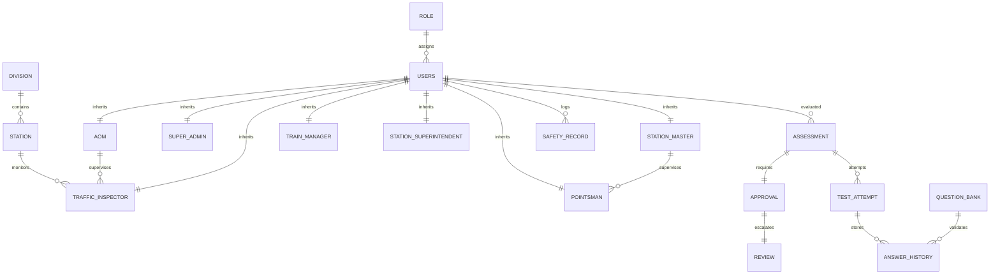

# 🚂 Indian Railway Staff Evaluation System (RSES)
## 🗺️ Database Mapping Blueprint & ERD Alignment

This document details the direct mapping of frontend mock datasets to the correct PostgreSQL database design based on the **RSES ER Diagram** (which includes Assessment Workflow & Approval Flow). It provides a structural gap analysis, a table responsibility matrix, reports on missing database tables and relationships, and a final data architecture blueprint.

---

## 📂 1. Mock Data → Database Mapping

The following mapping links each identified frontend mock dataset to its corresponding database tables, specifying primary keys, foreign keys, relationships, data ownership, and the responsible frontend module.

### A. Pointsman Module Datasets

#### 1. `pointsmanProfile` (from `src/data/mockPointsmanData.js`)
* **Database Tables:** `USERS` (Base credentials), `POINTSMAN` (Role-specific attributes), `EMPLOYEE_PROFILE` (Demographic bio), `PME_RECORD` (Medical monitoring), `MONITORING` (Risk details).
* **Primary Keys (PK):** 
  * `USERS.user_id`
  * `POINTSMAN.pm_id`
  * `EMPLOYEE_PROFILE.profile_id`
  * `PME_RECORD.pme_id`
  * `MONITORING.monitoring_id`
* **Foreign Keys (FK):**
  * `USERS.role_id` $\rightarrow$ `ROLE.role_id`
  * `POINTSMAN.user_id` $\rightarrow$ `USERS.user_id`
  * `POINTSMAN.sm_id` $\rightarrow$ `STATION_MASTER.sm_id`
  * `EMPLOYEE_PROFILE.user_id` $\rightarrow$ `USERS.user_id`
  * `PME_RECORD.user_id` $\rightarrow$ `USERS.user_id`
  * `MONITORING.user_id` $\rightarrow$ `USERS.user_id`
* **Table Relationships:** 
  * `USERS` $\leftrightarrow$ `POINTSMAN` (One-to-One, on `user_id`)
  * `USERS` $\leftrightarrow$ `EMPLOYEE_PROFILE` (One-to-One, on `user_id`)
  * `USERS` $\leftrightarrow$ `PME_RECORD` (One-to-One, on `user_id`)
  * `USERS` $\leftrightarrow$ `MONITORING` (One-to-One, on `user_id`)
  * `POINTSMAN` $\leftrightarrow$ `STATION_MASTER` (Many-to-One, on `sm_id`)
* **Data Ownership:** Read-only for the Pointsman. Managed by Station Masters (shunting assignments, reporting lines) and Traffic Inspectors (safety classifications, monitoring levels).
* **Responsible Module:** `PointsmanModule.jsx` (displays own stats), `StationMasterModule.jsx` (manages reporting), and `TrafficInspectorModule.jsx` (updates risk classification).

#### 2. `rawQuestions` / `testQuestions` (from `src/data/mockPointsmanData.js`)
* **Database Table:** `QUESTION_BANK`
* **Primary Key (PK):** `QUESTION_BANK.question_id`
* **Foreign Keys (FK):** None
* **Table Relationships:** 
  * `QUESTION_BANK` $\leftrightarrow$ `ANSWER_HISTORY` (One-to-Many, on `question_id`)
* **Data Ownership:** Super Admin (system configuration of safety guidelines).
* **Responsible Module:** `PointsmanModule.jsx` (loads questions in the exam engine).

#### 3. `initialHistory` (from `src/data/mockPointsmanData.js`)
* **Database Tables:** `TEST_ATTEMPT` (Attempt details), `ASSESSMENT` (Parent schedule), `ANSWER_HISTORY` (User option logs).
* **Primary Keys (PK):** `attempt_id` (attempt), `assessment_id` (schedule), `answer_id` (answers).
* **Foreign Keys (FK):**
  * `TEST_ATTEMPT.assessment_id` $\rightarrow$ `ASSESSMENT.assessment_id`
  * `TEST_ATTEMPT.employee_id` $\rightarrow$ `USERS.user_id`
  * `ANSWER_HISTORY.attempt_id` $\rightarrow$ `TEST_ATTEMPT.attempt_id`
  * `ANSWER_HISTORY.question_id` $\rightarrow$ `QUESTION_BANK.question_id`
* **Table Relationships:**
  * `ASSESSMENT` $\leftrightarrow$ `TEST_ATTEMPT` (One-to-Many, on `assessment_id`)
  * `TEST_ATTEMPT` $\leftrightarrow$ `ANSWER_HISTORY` (One-to-Many, on `attempt_id`)
  * `USERS` $\leftrightarrow$ `TEST_ATTEMPT` (One-to-Many, on `employee_id`)
* **Data Ownership:** Pointsman (personal historical progress, read-only).
* **Responsible Module:** `PointsmanModule.jsx` (historical scores list).

---

### B. Station Master Module Datasets

#### 1. `smProfile` (from `src/data/mockStationMasterData.js`)
* **Database Tables:** `USERS`, `STATION_MASTER`, `EMPLOYEE_PROFILE`, `PME_RECORD`.
* **Primary Keys (PK):** `USERS.user_id`, `STATION_MASTER.sm_id`.
* **Foreign Keys (FK):**
  * `STATION_MASTER.user_id` $\rightarrow$ `USERS.user_id`
  * `STATION_MASTER.station_id` $\rightarrow$ `STATION.station_id`
* **Table Relationships:**
  * `USERS` $\leftrightarrow$ `STATION_MASTER` (One-to-One, on `user_id`)
  * `STATION_MASTER` $\leftrightarrow$ `STATION` (Many-to-One, on `station_id`)
* **Data Ownership:** Station Master (personal bio, read-only).
* **Responsible Module:** `StationMasterModule.jsx` (dashboard context).

#### 2. `initialPointsmen` (from `src/data/mockStationMasterData.js`)
* **Database Tables:** `USERS` + `POINTSMAN` + `EMPLOYEE_PROFILE` (filtered by station).
* **Primary Keys (PK):** `USERS.user_id`, `POINTSMAN.pm_id`.
* **Foreign Keys (FK):**
  * `POINTSMAN.user_id` $\rightarrow$ `USERS.user_id`
  * `POINTSMAN.sm_id` $\rightarrow$ `STATION_MASTER.sm_id`
* **Table Relationships:**
  * `STATION_MASTER` $\leftrightarrow$ `POINTSMAN` (One-to-Many, on `sm_id`)
* **Data Ownership:** Managed by the active Station Master at the station.
* **Responsible Module:** `StationMasterModule.jsx` (Supervision Directory and Assessment scheduler).

#### 3. `pmAssessmentHistory` (from `src/data/mockStationMasterData.js`)
* **Database Tables:** `ASSESSMENT` + `TEST_ATTEMPT` + `APPROVAL` + `REVIEW` (filtered by Pointsman roles).
* **Primary Keys (PK):** `attempt_id` (attempt), `approval_id` (approval), `review_id` (review).
* **Foreign Keys (FK):**
  * `TEST_ATTEMPT.assessment_id` $\rightarrow$ `ASSESSMENT.assessment_id`
  * `APPROVAL.assessment_id` $\rightarrow$ `ASSESSMENT.assessment_id`
  * `APPROVAL.approved_by` $\rightarrow$ `USERS.user_id` (Traffic Inspector ID)
  * `REVIEW.approval_id` $\rightarrow$ `APPROVAL.approval_id`
  * `REVIEW.reviewed_by` $\rightarrow$ `USERS.user_id` (AOM ID)
* **Table Relationships:**
  * `ASSESSMENT` $\leftrightarrow$ `APPROVAL` (One-to-One, on `assessment_id`)
  * `APPROVAL` $\leftrightarrow$ `REVIEW` (One-to-One, on `approval_id`)
* **Data Ownership:** Conducted by Station Master, Approved by Traffic Inspector, Reviewed by AOM.
* **Responsible Module:** `StationMasterModule.jsx` (submits checklists), `TrafficInspectorModule.jsx` (approves), `AOmModule.jsx` (finalizes).

#### 4. `initialDrafts` (from `src/data/mockStationMasterData.js`)
* **Database Table:** `ASSESSMENT` (with `status = 'Draft'`).
* **Primary Key (PK):** `ASSESSMENT.assessment_id`
* **Foreign Keys (FK):**
  * `ASSESSMENT.employee_id` $\rightarrow$ `USERS.user_id`
  * `ASSESSMENT.conducted_by` $\rightarrow$ `USERS.user_id`
* **Table Relationships:**
  * `USERS` $\leftrightarrow$ `ASSESSMENT` (One-to-Many)
* **Data Ownership:** Station Master (draft evaluations, private editing).
* **Responsible Module:** `StationMasterModule.jsx` (Drafts queue).

---

### C. Traffic Inspector (TI) Module Datasets

#### 1. `TI_PROFILE` (from `src/constants/trafficInspectorConstants.js`)
* **Database Tables:** `USERS`, `TRAFFIC_INSPECTOR`, `EMPLOYEE_PROFILE`.
* **Primary Keys (PK):** `USERS.user_id`, `TRAFFIC_INSPECTOR.ti_id`.
* **Foreign Keys (FK):**
  * `TRAFFIC_INSPECTOR.user_id` $\rightarrow$ `USERS.user_id`
  * `TRAFFIC_INSPECTOR.station_id` $\rightarrow$ `STATION.station_id`
  * `TRAFFIC_INSPECTOR.reporting_aom` $\rightarrow$ `AOM.aom_id`
* **Table Relationships:**
  * `USERS` $\leftrightarrow$ `TRAFFIC_INSPECTOR` (One-to-One, on `user_id`)
  * `TRAFFIC_INSPECTOR` $\leftrightarrow$ `AOM` (Many-to-One, on `reporting_aom`)
* **Data Ownership:** Safety officer (read-only bio).
* **Responsible Module:** `TrafficInspectorModule.jsx`.

#### 2. `INIT_INSPECTIONS` (from `src/data/mockTrafficInspectorData.js`)
* **Database Table:** `SAFETY_RECORD` (where `incident_type = 'Inspection'`).
* **Primary Key (PK):** `SAFETY_RECORD.safety_id`
* **Foreign Keys (FK):**
  * `SAFETY_RECORD.user_id` $\rightarrow$ `USERS.user_id` (Safety Officer / TI conducting)
* **Table Relationships:**
  * `USERS` $\leftrightarrow$ `SAFETY_RECORD` (One-to-Many)
* **Data Ownership:** Traffic Inspector (conducts and logs station inspections).
* **Responsible Module:** `TrafficInspectorModule.jsx` (creates and views inspection lists).

#### 3. `INIT_COUNSELLING` (from `src/data/mockTrafficInspectorData.js`)
* **Database Table:** `SAFETY_RECORD` (where `incident_type = 'Counseling'`).
* **Primary Key (PK):** `SAFETY_RECORD.safety_id`
* **Foreign Keys (FK):**
  * `SAFETY_RECORD.user_id` $\rightarrow$ `USERS.user_id` (Employee being counseled)
* **Table Relationships:**
  * `USERS` $\leftrightarrow$ `SAFETY_RECORD` (One-to-Many)
* **Data Ownership:** Safety officer/TI conducts, employee receives counseling.
* **Responsible Module:** `TrafficInspectorModule.jsx` (manages rehabilitation).

---

### D. Train Manager & Station Superintendent Module Datasets

#### 1. `trainManagerProfile` / `rawQuestions` / `initialHistory` (from `src/data/mockTMData.js`)
* **Database Tables:** `USERS`, `TRAIN_MANAGER`, `EMPLOYEE_PROFILE`, `QUESTION_BANK`, `TEST_ATTEMPT`.
* **Primary Keys (PK):** `USERS.user_id`, `TRAIN_MANAGER.tm_id`.
* **Foreign Keys (FK):**
  * `TRAIN_MANAGER.user_id` $\rightarrow$ `USERS.user_id`
  * `TRAIN_MANAGER.station_id` $\rightarrow$ `STATION.station_id`
* **Table Relationships:**
  * `USERS` $\leftrightarrow$ `TRAIN_MANAGER` (One-to-One)
* **Data Ownership:** Train Manager (exam self-assessments).
* **Responsible Module:** `TrainManagerModule.jsx` (takes exam, checks logs).

#### 2. `INIT_USERS` / `rawQuestions` / `initialHistory` (from `src/data/mockSSData.js`)
* **Database Tables:** `USERS`, `STATION_SUPERINTENDENT`, `EMPLOYEE_PROFILE`, `QUESTION_BANK`, `TEST_ATTEMPT`.
* **Primary Keys (PK):** `USERS.user_id`, `STATION_SUPERINTENDENT.ss_id`.
* **Foreign Keys (FK):**
  * `STATION_SUPERINTENDENT.user_id` $\rightarrow$ `USERS.user_id`
  * `STATION_SUPERINTENDENT.station_id` $\rightarrow$ `STATION.station_id`
* **Table Relationships:**
  * `USERS` $\leftrightarrow$ `STATION_SUPERINTENDENT` (One-to-One)
* **Data Ownership:** Station Superintendent (manages station operations).
* **Responsible Module:** `StationSuperintendentModule.jsx`.

---

## 📊 2. Table Responsibility Matrix

The CRUD (Create, Read, Update, Delete) matrix below defines which system modules own write, edit, and lookup permissions for each database table in the ER diagram.

| Database Table | Super Admin | AOM/General | Traffic Inspector | Station Master | Station Superintendent | Train Manager | Pointsman |
| :--- | :--- | :--- | :--- | :--- | :--- | :--- | :--- |
| `ROLE` | **CRUD** | **R** | **R** | **R** | **R** | — | — |
| `DIVISION` | **CRUD** | **R** | **R** | **R** | **R** | — | — |
| `STATION` | **CRUD** | **RU** | **R** | **R** | **R** | — | — |
| `USERS` | **CRUD** | **RU** | **R** | **R** | **R** | **R** | **R** |
| `EMPLOYEE_PROFILE`| **CRUD** | **RU** | **R** | **R** | **R** | **R** | **R** |
| `SUPER_ADMIN` | **CRUD** | — | — | — | — | — | — |
| `AOM` | **CRUD** | **RU** | — | — | — | — | — |
| `TRAFFIC_INSPECTOR`| **CRUD** | **RU** | **RU** | — | — | — | — |
| `STATION_MASTER` | **CRUD** | **RU** | **RU** | **RU** | — | — | — |
| `TRAIN_MANAGER` | **CRUD** | **RU** | **RU** | — | — | **RU** | — |
| `STATION_SUPERINTENDENT`| **CRUD**| **RU** | **RU** | — | **RU** | — | — |
| `POINTSMAN` | **CRUD** | **RU** | **RU** | **RU** | — | — | **RU** |
| `PME_RECORD` | **CRUD** | **RU** | **RU** | **R** | **R** | **R** | **R** |
| `TRAINING_RECORD` | **CRUD** | **RU** | **RU** | **R** | **R** | **R** | **R** |
| `MONITORING` | **CRUD** | **RU** | **CRU** | **RU** | **R** | — | — |
| `QUESTION_BANK` | **CRUD** | **R** | **R** | **R** | **R** | **R** | **R** |
| `ASSESSMENT` | **CR** | **RU** | **CR** | **CR** | **CR** | — | — |
| `TEST_ATTEMPT` | **R** | **R** | **R** | **R** | **R** | **CR** | **CR** |
| `ANSWER_HISTORY` | **R** | — | — | — | — | **CR** | **CR** |
| `APPROVAL` | **R** | **CRU** | **CRU** | — | — | — | — |
| `REVIEW` | **R** | **CRU** | — | — | — | — | — |
| `SAFETY_RECORD` | **CRUD** | **R** | **CR** | **CR** | **CR** | — | — |
| `REPORT` | **CR** | **CR** | **R** | **R** | **R** | — | — |

* **C** = Create, **R** = Read, **U** = Update, **D** = Delete

---

## 🚫 3. Missing Tables Report

This report compares the active PostgreSQL provisioning file (`supabase_schema_provisioning.sql`) against the target ER Diagram. The active schema is currently flat, relying on general metadata columns. To match the ER diagram, the following **15 tables must be added**:

### 1. Specific Employee Subtype Profiles
* **Missing Tables:** `SUPER_ADMIN`, `AOM`, `TRAFFIC_INSPECTOR`, `STATION_MASTER`, `TRAIN_MANAGER`, `STATION_SUPERINTENDENT`, `POINTSMAN`.
* **Purpose:** The active schema consolidates all roles into a single `EMPLOYEE_PROFILE` table. The target ERD separates these into specific sub-tables to store role-specific fields (e.g., `reporting_aom` for `TRAFFIC_INSPECTOR`, `sm_id` reporting lines for `POINTSMAN`, and `shift` beats).
* **Impact of Absence:** Reporting structures cannot be enforced. Subtype attributes must currently be stored in catch-all fields in `EMPLOYEE_PROFILE`.

### 2. Testing & Answer Details
* **Missing Tables:** `QUESTION_BANK` and `ANSWER_HISTORY`.
* **Purpose:** `QUESTION_BANK` houses MCQ questions, options, and weightings. `ANSWER_HISTORY` captures each individual answer selected by an employee during a test.
* **Impact of Absence:** The frontend is forced to store and evaluate tests using hardcoded local JavaScript files. Detailed auditing of incorrect responses is impossible.

### 3. Multi-Level Signoffs & Workflows
* **Missing Tables:** `APPROVAL` and `REVIEW`.
* **Purpose:** To manage the workflow where SM safety evaluations are approved by a Traffic Inspector, which are then reviewed by the AOM.
* **Impact of Absence:** The system cannot track multi-tiered approvals. Approval history must currently be stored as flat text in remarks columns.

### 4. Safety & Operational Records
* **Missing Tables:** `PME_RECORD`, `TRAINING_RECORD`, `MONITORING`, and `REPORT`.
* **Purpose:** To separate medical monitoring (PME status), training tracking (refresher course compliance), and active safety monitoring from general incident logs.
* **Impact of Absence:** Storing these distinct records in a single table results in database parsing errors.

---

## 🔗 4. Missing Relationships Report

The following relationships defined in the target ER Diagram are missing from the current `supabase_schema_provisioning.sql` file:

### 1. Hierarchy & Supervision Relationships
* **`POINTSMAN` $\rightarrow$ `STATION_MASTER`:** Many-to-One via `sm_id`. Establishes reporting lines between Pointsmen and the Station Master managing their shift.
* **`TRAFFIC_INSPECTOR` $\rightarrow$ `AOM`:** Many-to-One via `reporting_aom`. Restricts safety inspector assignments to their division's Operations Manager.

### 2. Assessment Workflow Relationships
* **`TEST_ATTEMPT` $\rightarrow$ `ANSWER_HISTORY`:** One-to-Many via `attempt_id`. Connects exam results to the individual options selected by the candidate.
* **`QUESTION_BANK` $\rightarrow$ `ANSWER_HISTORY`:** One-to-Many via `question_id`. Ensures each recorded response references a valid system question.
* **`ASSESSMENT` $\leftrightarrow$ `APPROVAL`:** One-to-One via `assessment_id`. Tracks the supervisor approval stage.
* **`APPROVAL` $\leftrightarrow$ `REVIEW`:** One-to-One via `approval_id`. Links supervisor approvals to AOM reviews.

---

## 🏗️ 5. Final Data Architecture Blueprint

The diagram below illustrates the updated data architecture, showing the relationships between master data, users, exams, and workflows.

### Key Data Architecture Policies:

#### 🔑 Primary Key Strategy
All tables inherit either a system-generated auto-incrementing integer (e.g., `user_id`, `station_id`) or use foreign keys as primary keys in subtype tables (e.g., `sm_id` in `STATION_MASTER` is both the Primary Key and references `USERS.user_id` as a Foreign Key).

#### 🛡️ Referential Integrity & Cascade Rules
* **User Deletion:** `ON DELETE CASCADE` is applied to employee subtypes (`POINTSMAN`, `STATION_MASTER`, etc.), `EMPLOYEE_PROFILE`, and `PME_RECORD`. If a user is deleted from `USERS`, their profiles are removed automatically.
* **Master Records:** `ON DELETE RESTRICT` is applied to `ROLE` and `DIVISION` to prevent the deletion of active organizational roles.
* **Test Attempts:** `ON DELETE CASCADE` is applied to `ANSWER_HISTORY` to ensure answer logs are deleted if their parent test attempt is removed.

#### 🔄 Transactional Workflows
When a pointsman completes an exam, the system must write records using a database transaction:
1. Create a `TEST_ATTEMPT` record.
2. Insert multiple `ANSWER_HISTORY` records referencing the `attempt_id`.
3. Create an `ASSESSMENT` record with status set to `'Completed'`.
4. Trigger an update in the employee's `EMPLOYEE_PROFILE` to recalculate safety compliance and category scores.
