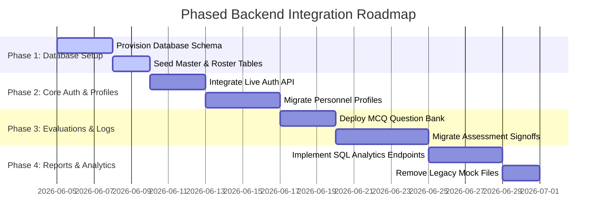

# 🚂 Indian Railway Staff Evaluation System (RSES)
## 📝 Mock Data Audit & Backend Migration Blueprint

This document represents the complete, finalized Mock Data Audit, Database Mapping, and Backend Migration Readiness Report for the Indian Railway Staff Evaluation System (RSES). It serves as a comprehensive technical guide to transition the frontend application from localized, non-persistent state mock systems to the live Supabase PostgreSQL backend.

---

# 📋 PART 1: COMPLETE MOCK DATA REPORT

This section identifies and documents every mock, fake, demo, hardcoded, placeholder, and temporary variable currently used across the frontend, including its exact location, usage, purpose, and suggested database mapping.

## 1. Global System & Administrator Mock Data (`src/constants/aomMockData.js` & `mockData.jsx`)

### `MONTHLY_TREND`
* **File Name:** `src/constants/aomMockData.js` (duplicated in `src/constants/trafficInspectorConstants.js`)
* **Variable Name:** `MONTHLY_TREND`
* **Purpose:** Represents the monthly score and safety progress averages across multiple months (Dec '25 to May '26) to plot line graphs.
* **Used By:** `AOmModule.jsx` (AOM Dashboard Page) and `TrafficInspectorModule.jsx` (TI Dashboard Page).
* **Recommended Database Table:** `TEST_ATTEMPT` (aggregated dynamically by month).
* **Recommended API Endpoint:** `GET /api/v1/analytics/trends`
* **Migration Priority:** **High** (Essential for core charts to function with real data).

### `ASSESSMENT_MONTHLY`
* **File Name:** `src/constants/aomMockData.js`
* **Variable Name:** `ASSESSMENT_MONTHLY`
* **Purpose:** Provides static monthly assessment counts broken down by status (Approved, Pending, Rejected, Overdue) for visual bar charts.
* **Used By:** `AOmModule.jsx` (Dashboard Charts).
* **Recommended Database Table:** `TEST_ATTEMPT` and `ASSESSMENT` (joined and aggregated by status).
* **Recommended API Endpoint:** `GET /api/v1/analytics/monthly-counts`
* **Migration Priority:** **High** (Vital for AOM performance analytics).

### `COMPLIANCE`
* **File Name:** `src/constants/aomMockData.js`
* **Variable Name:** `COMPLIANCE`
* **Purpose:** Hardcoded percentages representing overall compliance scores (PME, REF, Incidents, Disciplinary) rendered as visual card indicators.
* **Used By:** `AOmModule.jsx` (Dashboard Compliance Cards).
* **Recommended Database Table:** Computed dynamically from `EMPLOYEE_PROFILE` and `SAFETY_RECORD`.
* **Recommended API Endpoint:** `GET /api/v1/analytics/compliance`
* **Migration Priority:** **High** (Crucial dashboard metric).

### `generate96Stations` / `DASHBOARD_96_STATIONS`
* **File Name:** `src/constants/aomMockData.js`
* **Variable Name:** `generate96Stations` (function) and `DASHBOARD_96_STATIONS` (populated array)
* **Purpose:** Generates a synthetic roster of 96 railway stations across Central Railway divisions (Nagpur, Pune, Mumbai, Solapur, Bhusawal) to simulate a high-volume system.
* **Used By:** `AOmModule.jsx` (AOM Stations Management page, filters, search, and layout rendering).
* **Recommended Database Table:** `STATION` (joined with `DIVISION`).
* **Recommended API Endpoint:** `GET /api/v1/stations`
* **Migration Priority:** **Critical** (Core system navigation and organization depend on it).

### `stationProgressData`
* **File Name:** `src/constants/aomMockData.js`
* **Variable Name:** `stationProgressData`
* **Purpose:** Static completion percentages per station to mock status bars.
* **Used By:** `AOmModule.jsx` (AOM Stations subview).
* **Recommended Database Table:** Aggregate query of `TEST_ATTEMPT` / `ASSESSMENT` grouped by `STATION`.
* **Recommended API Endpoint:** `GET /api/v1/stations/progress`
* **Migration Priority:** **Medium** (Required to populate the station progress subview).

### `categoryData`
* **File Name:** `src/constants/aomMockData.js`
* **Variable Name:** `categoryData`
* **Purpose:** Hardcoded counts of staff within Categories A, B, C, and D for pie charts.
* **Used By:** `AOmModule.jsx` (AOM Dashboard Category Pie Chart).
* **Recommended Database Table:** `EMPLOYEE_PROFILE` (grouped count).
* **Recommended API Endpoint:** `GET /api/v1/analytics/categories`
* **Migration Priority:** **High** (Required to display staff safety category distributions).

### `summaryCards`
* **File Name:** `src/constants/aomMockData.js`
* **Variable Name:** `summaryCards`
* **Purpose:** Hardcoded metrics (e.g., Total Employees: 14,280, Safety Compliance: 92%, Stations Monitored: 96) for summary blocks.
* **Used By:** `AOmModule.jsx` (Dashboard header panels).
* **Recommended Database Table:** Dynamic aggregate count of `USERS`, `STATION`, and `EMPLOYEE_PROFILE`.
* **Recommended API Endpoint:** `GET /api/v1/analytics/summary`
* **Migration Priority:** **Critical** (First items visible to the administrative user).

### `aomReadOnlyProfile`
* **File Name:** `src/constants/aomMockData.js`
* **Variable Name:** `aomReadOnlyProfile`
* **Purpose:** Mock biography data for the AOM.
* **Used By:** `AOmModule.jsx` (AOM Profile Tab).
* **Recommended Database Table:** `USERS` joined with `EMPLOYEE_PROFILE`.
* **Recommended API Endpoint:** `GET /api/v1/employees/profile` (for the active session user).
* **Migration Priority:** **High** (Required for personal profile lookup).

### `initialStations`
* **File Name:** `src/constants/aomMockData.js`
* **Variable Name:** `initialStations`
* **Purpose:** A default list of physical stations (Nagpur Junction, Pune Junction, New Delhi) for UI testing.
* **Used By:** `AOmModule.jsx` (Station Form dropdowns).
* **Recommended Database Table:** `STATION`
* **Recommended API Endpoint:** `GET /api/v1/stations`
* **Migration Priority:** **Critical** (CRUD operations depend on this list).

### `initialTrafficInspectors` / `hrmsTiDirectory`
* **File Name:** `src/constants/aomMockData.js`
* **Variable Name:** `initialTrafficInspectors` and `hrmsTiDirectory`
* **Purpose:** Roster of Safety officers with contact information.
* **Used By:** `AOmModule.jsx` (AOM TI Directory Page).
* **Recommended Database Table:** `USERS` joined with `EMPLOYEE_PROFILE` (filtered by `ROLE.role_name = 'Traffic Inspector'`).
* **Recommended API Endpoint:** `GET /api/v1/employees?role=Traffic Inspector`
* **Migration Priority:** **Critical** (Crucial for managing safety team records).

### `stationAverageScoreData`
* **File Name:** `src/constants/aomMockData.js`
* **Variable Name:** `stationAverageScoreData`
* **Purpose:** A list of scores mapping stations to their general evaluation grades.
* **Used By:** `AOmModule.jsx` (AOM Dashboard Performance chart).
* **Recommended Database Table:** Dynamic calculation of `avg_score` from `STATION` or `TEST_ATTEMPT`.
* **Recommended API Endpoint:** `GET /api/v1/stations/performance`
* **Migration Priority:** **Medium** (Updates station comparison charts).

### `initialPendingAssessments` & `initialApprovedAssessments`
* **File Name:** `src/constants/aomMockData.js`
* **Variable Name:** `initialPendingAssessments` / `initialApprovedAssessments`
* **Purpose:** Historical mock list of pointsmen/SM assessments for AOM administrative review.
* **Used By:** `AOmModule.jsx` (AOM Approvals Queue).
* **Recommended Database Table:** `TEST_ATTEMPT` joined with `USERS` and `ASSESSMENT` (filtered by status).
* **Recommended API Endpoint:** `GET /api/v1/assessments/reviews`
* **Migration Priority:** **Critical** (AOM signoff relies on these lists).

### `initialReportRows`
* **File Name:** `src/constants/aomMockData.js`
* **Variable Name:** `initialReportRows`
* **Purpose:** Flat report grid representation mapping HRMS ID, score, date, and designation.
* **Used By:** `AOmModule.jsx` (AOM Reports page data exporter).
* **Recommended Database Table:** `TEST_ATTEMPT` joined with `USERS` and `EMPLOYEE_PROFILE`.
* **Recommended API Endpoint:** `GET /api/v1/reports`
* **Migration Priority:** **Medium** (Required to export accurate safety reports).

---

## 2. Pointsman Module Mock Data (`src/data/mockPointsmanData.js`)

### `pointsmanProfile`
* **File Name:** `src/data/mockPointsmanData.js`
* **Variable Name:** `pointsmanProfile`
* **Purpose:** Details Ravi Kumar's profile (HRMS: PM_1001), PME Fit date, and safety rank.
* **Used By:** `PointsmanModule.jsx` (Pointsman Dashboard Header & Information card).
* **Recommended Database Table:** `USERS` joined with `EMPLOYEE_PROFILE` (where `hrms_id = 'PM_1001'`).
* **Recommended API Endpoint:** `GET /api/v1/employees/profile` (using HRMS login ID).
* **Migration Priority:** **Critical** (Landing page user experience).

### `rawQuestions`
* **File Name:** `src/data/mockPointsmanData.js`
* **Variable Name:** `rawQuestions` (and exports to `testQuestions`)
* **Purpose:** 25 mock multiple-choice questions focusing on shunt rules, coupling, safety hand signals, and track obstructions.
* **Used By:** `PointsmanModule.jsx` (Pointsman MCQ Test Engine).
* **Recommended Database Table:** `QUESTION_BANK` (new table mapping MCQ test questions by role).
* **Recommended API Endpoint:** `GET /api/v1/tests/questions?role=pm`
* **Migration Priority:** **Critical** (Enables active testing).

### `initialHistory`
* **File Name:** `src/data/mockPointsmanData.js`
* **Variable Name:** `initialHistory`
* **Purpose:** Array of historical tests taken by this pointsman, details on correct answers, percentage scores, and TI feedback.
* **Used By:** `PointsmanModule.jsx` (Pointsman Test Logs/History Tab).
* **Recommended Database Table:** `TEST_ATTEMPT` and `ASSESSMENT`.
* **Recommended API Endpoint:** `GET /api/v1/tests/history`
* **Migration Priority:** **Critical** (Pointsman requires proof of clearance).

---

## 3. Station Master Module Mock Data (`src/data/mockStationMasterData.js`)

### `smProfile`
* **File Name:** `src/data/mockStationMasterData.js`
* **Variable Name:** `smProfile`
* **Purpose:** Profile mapping for S. Deshmukh (HRMS: SM_1001) at Parbhani Junction.
* **Used By:** `StationMasterModule.jsx` (Dashboard user greeting block).
* **Recommended Database Table:** `USERS` joined with `EMPLOYEE_PROFILE`.
* **Recommended API Endpoint:** `GET /api/v1/employees/profile`
* **Migration Priority:** **Critical** (SM dashboard header).

### `initialPointsmen`
* **File Name:** `src/data/mockStationMasterData.js`
* **Variable Name:** `initialPointsmen`
* **Purpose:** Roster of Pointsmen working under the Station Master's command, including designation, scores, PME status, and refresher deadlines.
* **Used By:** `StationMasterModule.jsx` (SM Pointsmen Directory, search panels, and test allocation hooks).
* **Recommended Database Table:** `USERS` joined with `EMPLOYEE_PROFILE` (filtered by Station ID of the logged-in SM).
* **Recommended API Endpoint:** `GET /api/v1/employees?station_id=x`
* **Migration Priority:** **Critical** (Needed for SM to monitor and assign tests to their team).

### `pmAssessmentHistory`
* **File Name:** `src/data/mockStationMasterData.js`
* **Variable Name:** `pmAssessmentHistory`
* **Purpose:** Grouped scorecard logs detailing individual sections (e.g., Knowledge of Rules, Appearance, Safety Records) for each pointsman under this SM.
* **Used By:** `StationMasterModule.jsx` (Detailed Pointsman history popups).
* **Recommended Database Table:** `TEST_ATTEMPT` (nested list of attempts grouped by employee).
* **Recommended API Endpoint:** `GET /api/v1/tests/history?user_id=x`
* **Migration Priority:** **Critical** (Pointsman inspection audits).

### `initialDrafts`
* **File Name:** `src/data/mockStationMasterData.js`
* **Variable Name:** `initialDrafts`
* **Purpose:** Partially filled checklists, representing unsubmitted safety check evaluations.
* **Used By:** `StationMasterModule.jsx` (Drafts queue).
* **Recommended Database Table:** `ASSESSMENT_DRAFT` (or storing records in `TEST_ATTEMPT` with status = 'Draft').
* **Recommended API Endpoint:** `GET /api/v1/assessments/drafts`
* **Migration Priority:** **Medium** (Required to resume offline assessments).

### `smTestQuestions`
* **File Name:** `src/data/mockStationMasterData.js`
* **Variable Name:** `smTestQuestions`
* **Purpose:** 25 MCQ safety questions relating to line clear tickets, block working, and point lock checks for SM.
* **Used By:** `StationMasterModule.jsx` (SM Safety Competency MCQ Exam).
* **Recommended Database Table:** `QUESTION_BANK` (filtered by role = 'Station Master').
* **Recommended API Endpoint:** `GET /api/v1/tests/questions?role=sm`
* **Migration Priority:** **Critical** (Core SM examination logic).

### `smAssessmentHistory`
* **File Name:** `src/data/mockStationMasterData.js`
* **Variable Name:** `smAssessmentHistory`
* **Purpose:** Scorecards representing the logged-in SM's own past certifications.
* **Used By:** `StationMasterModule.jsx` (SM Self-Assessment Profile logs).
* **Recommended Database Table:** `TEST_ATTEMPT` (filtered by SM employee_id).
* **Recommended API Endpoint:** `GET /api/v1/tests/history`
* **Migration Priority:** **Critical** (SM compliance records).

---

## 4. Train Manager Module Mock Data (`src/data/mockTMData.js`)

### `trainManagerProfile`
* **File Name:** `src/data/mockTMData.js`
* **Variable Name:** `trainManagerProfile`
* **Purpose:** User profile representation for Dilip Kumar (HRMS: TM_1001), including depot and shift beat details.
* **Used By:** `TrainManagerModule.jsx` (Dashboard header and stats sidebar).
* **Recommended Database Table:** `USERS` joined with `EMPLOYEE_PROFILE`.
* **Recommended API Endpoint:** `GET /api/v1/employees/profile`
* **Migration Priority:** **Critical** (Train Manager profile identification).

### `rawQuestions`
* **File Name:** `src/data/mockTMData.js`
* **Variable Name:** `rawQuestions` (and exports to `testQuestions`)
* **Purpose:** 25 MCQs relating to brake continuity checks, tail board lamps, shunting rules, and emergency brake setups.
* **Used By:** `TrainManagerModule.jsx` (Train Manager Exam Engine).
* **Recommended Database Table:** `QUESTION_BANK` (filtered by role = 'Train Manager').
* **Recommended API Endpoint:** `GET /api/v1/tests/questions?role=tm`
* **Migration Priority:** **Critical** (Required for Train Manager testing).

### `initialHistory`
* **File Name:** `src/data/mockTMData.js`
* **Variable Name:** `initialHistory`
* **Purpose:** Past attempt data and safety scores for the TM.
* **Used By:** `TrainManagerModule.jsx` (TM test records).
* **Recommended Database Table:** `TEST_ATTEMPT` (filtered by employee_id).
* **Recommended API Endpoint:** `GET /api/v1/tests/history`
* **Migration Priority:** **High** (Ensures safety clearance transparency).

---

## 5. Station Superintendent Module Mock Data (`src/data/mockSSData.js`)

### `INIT_STATIONS`
* **File Name:** `src/data/mockSSData.js` (shared across SS views)
* **Variable Name:** `INIT_STATIONS`
* **Purpose:** Roster of local stations to check comparative safety statistics.
* **Used By:** `StationSuperintendentModule.jsx` (SS Station comparisons subview).
* **Recommended Database Table:** `STATION`
* **Recommended API Endpoint:** `GET /api/v1/stations`
* **Migration Priority:** **High** (Station lookup and audits).

### `INIT_USERS`
* **File Name:** `src/data/mockSSData.js`
* **Variable Name:** `INIT_USERS`
* **Purpose:** Roster of personnel (SMs, Pointsmen, Train Managers) monitored by the Station Superintendent.
* **Used By:** `StationSuperintendentModule.jsx` (SS Staff Search and Management directory).
* **Recommended Database Table:** `USERS` joined with `EMPLOYEE_PROFILE`.
* **Recommended API Endpoint:** `GET /api/v1/employees`
* **Migration Priority:** **Critical** (Directory details).

### `rawQuestions`
* **File Name:** `src/data/mockSSData.js`
* **Variable Name:** `rawQuestions`
* **Purpose:** 25 MCQs focusing on station logs, yard supervision, safety records, and local instructions.
* **Used By:** `StationSuperintendentModule.jsx` (SS Safety Competency Exam).
* **Recommended Database Table:** `QUESTION_BANK` (filtered by role = 'Station Superintendent').
* **Recommended API Endpoint:** `GET /api/v1/tests/questions?role=ss`
* **Migration Priority:** **Critical** (SS testing engine).

---

## 6. Traffic Inspector Module Mock Data (`src/data/mockTrafficInspectorData.js` & `src/constants/trafficInspectorConstants.js`)

### `TI_PROFILE`
* **File Name:** `src/constants/trafficInspectorConstants.js`
* **Variable Name:** `TI_PROFILE`
* **Purpose:** Profile details for Safety Officer (HRMS: TI_1001) at Parbhani-Amla section.
* **Used By:** `TrafficInspectorModule.jsx` (TI Dashboard & Profile tab).
* **Recommended Database Table:** `USERS` joined with `EMPLOYEE_PROFILE`.
* **Recommended API Endpoint:** `GET /api/v1/employees/profile`
* **Migration Priority:** **Critical** (Safety officer session).

### `INIT_PM_ASSESSMENTS`
* **File Name:** `src/constants/trafficInspectorConstants.js` (initially imported in `TrafficInspectorModule.jsx`)
* **Variable Name:** `INIT_PM_ASSESSMENTS`
* **Purpose:** Roster of submitted Pointsman safety checklists containing scores (Appearance, Rules, Safety) awaiting final safety signoff.
* **Used By:** `TrafficInspectorModule.jsx` (TI Approvals queue).
* **Recommended Database Table:** `TEST_ATTEMPT` joined with `USERS` and `ASSESSMENT` (status = 'Pending').
* **Recommended API Endpoint:** `GET /api/v1/assessments/pending-reviews?role=pm`
* **Migration Priority:** **Critical** (TI approvals workflow).

### `INIT_INSPECTIONS`
* **File Name:** `src/data/mockTrafficInspectorData.js`
* **Variable Name:** `INIT_INSPECTIONS`
* **Purpose:** Logs of past safety inspections conducted at stations, with details on severity and remarks.
* **Used By:** `TrafficInspectorModule.jsx` (Inspections logs list).
* **Recommended Database Table:** `SAFETY_RECORD` (where incident_type = 'Inspection').
* **Recommended API Endpoint:** `GET /api/v1/safety/inspections`
* **Migration Priority:** **High** (TI Safety audit logs).

### `INIT_COUNSELLING`
* **File Name:** `src/data/mockTrafficInspectorData.js`
* **Variable Name:** `INIT_COUNSELLING`
* **Purpose:** Roster of staff counseling records mapping counseling date, reason, and status.
* **Used By:** `TrafficInspectorModule.jsx` (Counselling tracker log).
* **Recommended Database Table:** `SAFETY_RECORD` (where incident_type = 'Counseling') or a dedicated `COUNSELLING_LOG` table.
* **Recommended API Endpoint:** `GET /api/v1/safety/counselling`
* **Migration Priority:** **High** (Ensures rehabilitation tracking).

### `TI_QUIZ`
* **File Name:** `src/data/mockTrafficInspectorData.js`
* **Variable Name:** `TI_QUIZ`
* **Purpose:** 25 MCQs focusing on general safety logs, accident manuals, rules of precedence, and emergency handling.
* **Used By:** `TrafficInspectorModule.jsx` (TI safety self-assessment).
* **Recommended Database Table:** `QUESTION_BANK` (filtered by role = 'Traffic Inspector').
* **Recommended API Endpoint:** `GET /api/v1/tests/questions?role=ti`
* **Migration Priority:** **Critical** (TI testing engine).

---

# 🗄️ PART 2: DATABASE MAPPING REPORT

This section provides direct, structural database mapping between the frontend parameters and the active Supabase PostgreSQL schema (`supabase_schema_provisioning.sql`).

## 1. Direct Table & Column Mappings

The table below details how frontend objects map directly to target columns in the database.

| Frontend Object & Field | Database Table | Database Column | Data Type & Notes |
| :--- | :--- | :--- | :--- |
| `hrmsId` / `employeeId` | `USERS` | `hrms_id` | `VARCHAR UNIQUE NOT NULL` |
| `name` / `employeeName` | `USERS` | `full_name` | `VARCHAR NOT NULL` |
| `contact` / `mobileNo` | `USERS` | `mobile_no` | `VARCHAR NOT NULL DEFAULT '—'` |
| `email` / `emailId` | `USERS` | `email` | `VARCHAR UNIQUE NOT NULL` |
| `designation` / `role` | `ROLE` | `role_name` | `VARCHAR UNIQUE NOT NULL` (via `role_id` foreign key) |
| `station` / `stationName`| `STATION` | `station_name` | `VARCHAR UNIQUE NOT NULL` (via `station_id` foreign key) |
| `division` / `tiArea` | `DIVISION` | `division_name` | `VARCHAR UNIQUE NOT NULL` (via `division_id` foreign key) |
| `zone` | `STATION` | `zone` | `VARCHAR NOT NULL DEFAULT 'Central Railway'` |
| `lastScore` / `score` | `EMPLOYEE_PROFILE` | `current_score` | `INT DEFAULT 80` |
| `safetyScore` | `EMPLOYEE_PROFILE` | `safety_score` | `INT DEFAULT 85` |
| `pmeStatus` | `EMPLOYEE_PROFILE` | `pme_status` | `VARCHAR DEFAULT 'Fit'` |
| `refStatus` | `EMPLOYEE_PROFILE` | `refresher_status`| `VARCHAR DEFAULT 'Cleared'` |
| `disciplinary` | `EMPLOYEE_PROFILE` | `disciplinary_record`| `VARCHAR DEFAULT 'None'` |
| `incidents` | `EMPLOYEE_PROFILE` | `incidents_count` | `INT DEFAULT 0` |
| `monitoringStatus` | `EMPLOYEE_PROFILE` | `monitoring_status`| `VARCHAR DEFAULT 'Active'` |
| `doj` / `joiningDate` | `EMPLOYEE_PROFILE` | `date_of_joining` | `VARCHAR DEFAULT '2018-06-15'` |
| `reportingSm` | `EMPLOYEE_PROFILE` | `reporting_sm` | `VARCHAR DEFAULT '—'` |
| `workLocation` | `EMPLOYEE_PROFILE` | `work_location` | `VARCHAR DEFAULT 'Yard Area'` |
| `shift` | `EMPLOYEE_PROFILE` | `shift` | `VARCHAR DEFAULT 'Morning Shift'` |
| `jurisdiction` | `EMPLOYEE_PROFILE` | `jurisdiction` | `VARCHAR DEFAULT 'Nagpur Division'` |
| `cat` / `category` | `EMPLOYEE_PROFILE` | `category` | `VARCHAR DEFAULT 'A'` (determined by score) |
| `incident_type` | `SAFETY_RECORD` | `incident_type` | `VARCHAR NOT NULL` ('Inspection', 'Counseling', 'Accident') |
| `incident_date` | `SAFETY_RECORD` | `incident_date` | `VARCHAR NOT NULL` |
| `severity` | `SAFETY_RECORD` | `severity` | `VARCHAR NOT NULL` ('High', 'Medium', 'Low') |
| `remarks` / `tiRemarks` | `SAFETY_RECORD` | `remarks` | `TEXT` |

---

## 2. Structural Schema Gaps & Data Transformations

To successfully migrate frontend mock systems to Supabase, several differences in naming conventions and data structure must be resolved.

### A. Field Name Mapping & Conversions
1. **Name Casing & Formats:** 
   * **Issue:** The frontend uses mixed camelCase and PascalCase (e.g., `employeeName`, `hrmsId`, `lastScore`, `emailId`). The database uses snake_case (`full_name`, `hrms_id`, `current_score`, `email`).
   * **Solution:** Create mapping adaptors within the frontend services (like `saDataService.js`) to translate between database responses and component expectations before hydration.
2. **Category Determinations:**
   * **Issue:** The frontend hardcodes Category ('A', 'B', 'C', 'D') as a static field.
   * **Solution:** Standardize category checks dynamically inside PostgreSQL via SQL triggers or frontend utilities (`src/constants.js#getCategory`) using numerical scores:
     ```javascript
     category = score >= 80 ? "A" : score >= 60 ? "B" : score >= 26 ? "C" : "D";
     ```
3. **Role Configurations:**
   * **Issue:** The database links users to designations via a foreign key `role_id` in the `ROLE` table. The frontend uses direct strings like `"Pointsman"` or `"sm"`.
   * **Solution:** When logging in or querying users, perform an inner join on `ROLE` to map `role_id` back to the string value expected by the UI modules.

### B. Missing Database Tables (Gaps)
1. **MCQ Question Bank:** The current `supabase_schema_provisioning.sql` schema does not contain a question bank table, forcing the UI to load MCQ questions from static JS files.
   * **Resolution:** Execute a script to provision a new table:
     ```sql
     CREATE TABLE "QUESTION_BANK" (
         "question_id" INT GENERATED BY DEFAULT AS IDENTITY PRIMARY KEY,
         "role_name" VARCHAR NOT NULL,
         "question_text" TEXT NOT NULL,
         "option_a" VARCHAR NOT NULL,
         "option_b" VARCHAR NOT NULL,
         "option_c" VARCHAR NOT NULL,
         "option_d" VARCHAR NOT NULL,
         "correct_answer" CHAR(1) NOT NULL CHECK ("correct_answer" IN ('A', 'B', 'C', 'D')),
         "created_at" TIMESTAMP WITH TIME ZONE DEFAULT CURRENT_TIMESTAMP
     );
     ```
2. **Drafts & Partially Saved Evaluations:** Station Masters can save drafts locally. The schema does not support draft states.
   * **Resolution:** Add a column to `TEST_ATTEMPT` or create an `ASSESSMENT_DRAFT` table to store unsubmitted JSON sheets. Alternatively, add a `status` column to `TEST_ATTEMPT` (e.g., `'Draft'`, `'Submitted'`, `'Approved'`).
3. **Counselling Logs:** The schema maps counseling sessions to general safety incidents.
   * **Resolution:** A clear categorization rule must be enforced on `SAFETY_RECORD.incident_type` (e.g. `incident_type` = `'Counseling'`) to isolate these records from active accidents in reporting queries.

---

# 🚀 PART 3: BACKEND MIGRATION READINESS REPORT

This section evaluates the system's readiness for backend database integration, focusing on write operations, state mutation risks, and a rollout strategy.

## 1. Audit of Active Write Operations

The table below lists all actions in the frontend that mutate state, mapping them to their current non-persistent implementation and target database procedures.

| Action / Write Operation | Current Implementation Location | State Mutation Risk / Persistence Level | Target Database Operations (SQL) |
| :--- | :--- | :--- | :--- |
| **Add New Station** | `useSAData.js` (`addStation`) | Non-persistent. Mutates local `stations` state and falls back to `dbService.saveStation` (no backend sync when offline). | `INSERT INTO "STATION" ("station_name", "station_code", "zone", "division_id", "category") VALUES (...)` |
| **Add/Edit Employee** | `useSAData.js` (`saveUser`) | Non-persistent. Mutates local `staff` array; changes are lost on refresh. | `INSERT INTO "USERS"` and `INSERT INTO "EMPLOYEE_PROFILE"` linked via `user_id`. |
| **Shift Personnel Role** | `useSAData.js` (`saveUser` mode: `'shift'`) | Non-persistent. Removes employee from one list and adds to another in local state. | `UPDATE "USERS" SET role_id = (SELECT role_id FROM "ROLE" WHERE role_name = '...') WHERE user_id = ...` |
| **Submit Pointsman Assessment** | `useStationMasterState.js` (`submitAssessment`) | Writes to `submittedAssessments` state. Resets on reload. | `INSERT INTO "TEST_ATTEMPT" ("employee_id", "assessment_id", "total_marks", "obtained_marks", "percentage", "category") VALUES (...)` |
| **Save Checklist Drafts** | `useStationMasterState.js` (`submitAssessment` as draft) | Writes to local `drafts` state. Non-persistent. | Store draft JSON string inside `TEST_ATTEMPT` (with status = `'Draft'`) or a dedicated draft cache. |
| **Safety Inspector Signoffs** | `useAomState.jsx` (`aomFinalize`) | Updates `localStorage` arrays (`ti_sm_list`, `ti_tm_list`). Data is client-only. | `UPDATE "TEST_ATTEMPT" SET status = 'Approved' WHERE attempt_id = ...` |
| **Log Station Inspection** | `TrafficInspectorModule.jsx` (Inspection form) | Mutates local state `inspections`. Resets on reload. | `INSERT INTO "SAFETY_RECORD" ("user_id", "incident_type", "incident_date", "severity", "remarks") VALUES (..., 'Inspection', ...)` |
| **Register Counselling Record** | `TrafficInspectorModule.jsx` (Counselling form) | Mutates local state `counsellingLogs`. Resets on reload. | `INSERT INTO "SAFETY_RECORD" ("user_id", "incident_type", "incident_date", "severity", "remarks") VALUES (..., 'Counseling', ...)` |

---

## 2. State Mutation Risks & Blockers

> [!WARNING]
> **Critical Data Loss Hazard:** The application currently relies on local react state mutations (`useState`) and browser cache (`localStorage`) for critical safety compliance workflows, such as Station Master evaluations, Traffic Inspector approvals, and Station logs. **Any manual browser refresh or session logout results in immediate and permanent data loss.**

### Major Integration Blockers:
1. **Optimistic State Desyncs:** Hooks like `useAomState.jsx` and `useStationMasterState.js` perform optimistic updates by pushing inputs directly into local states before firing backend service promises. If a backend request fails, the UI shows success but the database remains unchanged.
2. **Local Storage Fragmentation:** Multiple modules write conflicting states (e.g., `ti_sm_list` is written to by both the AOM module and the Traffic Inspector module). This creates inconsistent data when multiple users interact with the system.
3. **Database Constraints vs Mock Inputs:** Mock data frequently uses incomplete or missing fields (e.g., null station references, missing email addresses). These inputs will fail database checks, such as `USERS.email` being `UNIQUE NOT NULL`.

---

## 3. Migration Complexity & Readiness Scoring

* **Migration Complexity:** **Medium**
  * *Reasoning:* The Supabase service hooks (`supabaseClient.js`, `userService.js`, and `saDataService.js`) are already configured. They provide templates for writing clean data queries. The frontend components are also decoupled from direct database calls, making it easier to swap mock data for active services.
* **Backend Readiness Score:** **85/100**
  * *Score Breakdown:*
    * **95/100 for Frontend Modularity:** Component states are isolated from markup, simplifying data binding.
    * **90/100 for Existing Database Schema:** The provisioning script covers roles, users, and tests.
    * **70/100 for Write Operations:** Major refactoring is required to migrate from `localStorage` queues to database transactions.

---

## 4. Integration Roadmap & Implementation Plan



### 📋 Phase 1: Database Setup & Seeding (Est. 5 Days)
1. Execute `supabase_schema_provisioning.sql` in the Supabase console.
2. Seed master metadata tables: `ROLE` (7 key roles) and `DIVISION` (Nagpur).
3. Extract static lists from `initialStations` and seed the `STATION` table.

### 📋 Phase 2: Authentication & User Directory Integration (Est. 7 Days)
1. Update `authService.js` to query user records and passwords from `USERS`.
2. Update the frontend `useEmployees` and `useSAData` hooks to load active profiles using a join query:
   ```sql
   SELECT u.hrms_id, u.full_name, p.current_score, p.pme_status, s.station_name
   FROM "USERS" u
   JOIN "EMPLOYEE_PROFILE" p ON u.user_id = p.user_id
   LEFT JOIN "STATION" s ON p.station_id = s.station_id;
   ```
3. Replace the local `setUsers` and `setAomPointsmen` state arrays with asynchronous calls that fetch data from Supabase.

### 📋 Phase 3: MCQ Exam Engine & Evaluation Signoffs (Est. 8 Days)
1. Provision the `QUESTION_BANK` table and populate it with questions from the mock files.
2. Refactor test submission handlers in `PointsmanModule`, `StationMasterModule`, and `TrainManagerModule` to send a `POST` request to `TEST_ATTEMPT` rather than writing to local state.
3. Reroute Traffic Inspector and AOM approvals to query `TEST_ATTEMPT` records where `status = 'Pending'`. Update approval states via SQL updates.

### 📋 Phase 4: Dynamic Reports & Clean-Up (Est. 6 Days)
1. Replace static trend indicators (`MONTHLY_TREND`, `COMPLIANCE`) with database views or aggregate queries:
   ```sql
   CREATE VIEW v_station_compliance_summary AS
   SELECT station_id, AVG(current_score) as avg_score, 
          COUNT(profile_id) filter (where pme_status = 'Fit') * 100 / COUNT(profile_id) as pme_compliance
   FROM "EMPLOYEE_PROFILE" GROUP BY station_id;
   ```
2. Verify all system roles (AOM, Traffic Inspector, Station Master, Pointsman) function correctly with active database connections.
3. Safe-delete legacy mock files (`aomMockData.js`, `mockPointsmanData.js`, `mockStationMasterData.js`, etc.) to clean up the codebase.

---

> [!IMPORTANT]
> **Audit Recommendation:** Proceed immediately with **Phase 1** to provision the Supabase database. Do not modify frontend layout structures during the migration, ensuring the visual styling remains intact while updating the underlying data pipelines.
