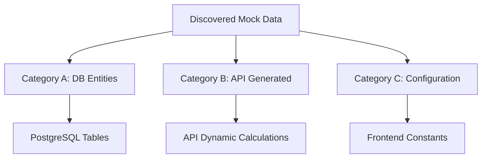
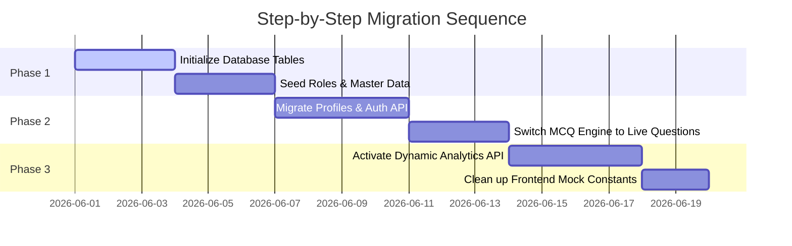

# 🚂 Indian Railway Staff Evaluation System (RSES)
## 📝 Mock Data Audit & Backend Migration Blueprint

This document provides a highly detailed audit of all mock, demo, hardcoded, and placeholder data sources across the Indian Railway Staff Evaluation & Competency System (RSES) frontend. It establishes a direct mapping to the active Supabase PostgreSQL schema (`supabase_schema_provisioning.sql`) and outlines a step-by-step risk and migration framework to guide backend integration safely.

---

## 🔍 Section 1: Audit Scope & Directory Scan

A comprehensive scan was conducted across the frontend source directories to capture every occurrence of hardcoded parameters, mock datasets, and generator utilities:

```
[Scan Targets]
 ├── src/constants/         -> Core system constants & global mock summaries
 ├── src/data/              -> Role-specific MCQ question banks & profiles
 ├── src/hooks/             -> React state hooks managing local state hydration
 ├── src/services/          -> Mock service operations (auth, user, station)
 └── src/main_modules/      -> Main dashboard views rendering static props
```

### Summary of Discovered Mock Data Files:
1. **`src/constants/aomMockData.js`** / **`mockData.jsx`**
   * *Type*: Global mock datasets, static KPI values, monthly trends, and station lists.
2. **`src/data/mockPointsmanData.js`**
   * *Type*: Pointsman operational questions (MCQs), profile, and historical scores.
3. **`src/data/mockStationMasterData.js`**
   * *Type*: Pointsmen supervisor registries, yes/no evaluation rubrics, SM test bank, and draft scores.
4. **`src/data/mockTrafficInspectorData.js`**
   * *Type*: Inspection logs, rehab counselling registries, TI test bank, and station metrics.
5. **`src/data/mockTMData.js`**
   * *Type*: Train Manager MCQ bank, shift details, and historical compliance records.
6. **`src/data/mockSSData.js`**
   * *Type*: Station Superintendent test bank, self-assessment history, and yard metrics.

---

## 🏷️ Section 2: Mock Data Classification

The discovered mock data is categorized into three levels to determine how each must be integrated with the PostgreSQL/Supabase database and REST/RPC API layers.



### Category A — Database Entities
*Must be securely migrated to PostgreSQL tables. Operations require full read/write capabilities.*
* **Personnel Records**: Pointsman profile, SM profile, TI profile, SS profile, TM profile.
* **Core Organizations**: Stations, divisions, and operational zones.
* **Evaluation Frameworks**: MCQ Question Banks, exam attempts, grading categories, and draft assessments.
* **Logistics & Safety Registries**: Station safety check inspections and employee counseling records.

### Category B — API Generated Data
*Derived parameters that should be computed in the backend or via SQL aggregation instead of being static arrays.*
* **Compliance Ratios**: Overall Safety Compliance, PME completion rate, and REF completion rate.
* **Trend Indicators**: Monthly safety index curves and evaluation timelines.
* **Aggregated Stats**: Station-by-station progress indicators, average score tallies, and KPI summary card numbers.

### Category C — Configuration Data
*Static operational parameters. These are appropriate to keep hardcoded in the frontend codebase.*
* **UI Routing**: Navigation menus (`NAV`, `sidebarItems`).
* **Design Systems**: Chart palettes (`CAT_COLORS`, `RISK_COLORS`, `STATUS_COLORS`).
* **Enumerations & Options**: Dropdown options (`designationOptions`, `departmentOptions`, `stationZoneOptions`).
* **Framework Parameters**: Weight coefficients (`YN_SECTIONS` out-of-counts).

---

## 🗄️ Section 3: Database & API Mapping Blueprint

This mapping connects each identified frontend mock variable directly to the active SQL tables specified in your **`supabase_schema_provisioning.sql`** schema, defining recommended API endpoints and priority rankings.

### 1. Global System Elements (`aomMockData.js` & `mockData.jsx`)

| Variable Name | Purpose | Currently Used By | Target Database Table | Recommended API Endpoint | Priority |
| :--- | :--- | :--- | :--- | :--- | :--- |
| `DASHBOARD_96_STATIONS` | Renders a generated list of 96 stations | AOM station directories & layout filters | `STATION` Table | `GET /api/v1/stations` | **High** |
| `initialStations` | Seed list of primary stations (NGP, PUNE, NDLS) | Station Master/Super Admin CRUD forms | `STATION` & `DIVISION` | `GET /api/v1/stations` | **Critical** |
| `initialTrafficInspectors` | Details on active division Inspectors | Admin and inspector directories | `USERS` & `EMPLOYEE_PROFILE` | `GET /api/v1/employees?role=TI` | **Critical** |
| `summaryCards` | High-level operations figures (14,280 Employees, etc.) | AOM main dashboard panels | Computed from `USERS`, `TEST_ATTEMPT` | `GET /api/v1/analytics/summary` | **High** |
| `MONTHLY_TREND` | Historical monthly progress scores | Analytics trend line-charts | Computed from `TEST_ATTEMPT` | `GET /api/v1/analytics/trends` | **Medium** |
| `COMPLIANCE` | System-wide PME and Refresher completion ratios | Compliance gauge charts | Computed from `EMPLOYEE_PROFILE` | `GET /api/v1/analytics/compliance` | **High** |

---

### 2. Pointsman Dashboards (`mockPointsmanData.js`)

| Variable Name | Purpose | Currently Used By | Target Database Table | Recommended API Endpoint | Priority |
| :--- | :--- | :--- | :--- | :--- | :--- |
| `pointsmanProfile` | Ravi Kumar profile (HRMS: PM_1001) | Pointsman main landing page | `USERS` & `EMPLOYEE_PROFILE` | `GET /api/v1/employees/profile` | **Critical** |
| `rawQuestions` | MCQ bank for Pointsmen | MCQ test taking engine | `QUESTION_BANK` (to be created) | `GET /api/v1/tests/questions?role=pm` | **High** |
| `initialHistory` | Past safety test history | Pointsman scorecards & performance lists | `TEST_ATTEMPT` & `ASSESSMENT` | `GET /api/v1/tests/history` | **Critical** |

---

### 3. Station Master Supervision (`mockStationMasterData.js`)

| Variable Name | Purpose | Currently Used By | Target Database Table | Recommended API Endpoint | Priority |
| :--- | :--- | :--- | :--- | :--- | :--- |
| `smProfile` | S. Deshmukh profile (HRMS: SM_1001) | Station Master dashboard header | `USERS` & `EMPLOYEE_PROFILE` | `GET /api/v1/employees/profile` | **Critical** |
| `initialPointsmen` | Roster of pointsmen assigned to the SM's station | PM monitoring tables & search | `USERS` & `EMPLOYEE_PROFILE` | `GET /api/v1/employees?station_id=x` | **Critical** |
| `pmAssessmentHistory` | Historical test marks for station pointsmen | PM profile detailed evaluation modal | `TEST_ATTEMPT` & `ASSESSMENT` | `GET /api/v1/tests/history?user_id=x` | **Critical** |
| `initialDrafts` | Unsubmitted evaluation sheets | Saved drafts checklist panels | `ASSESSMENT_DRAFT` (to be created) | `GET /api/v1/assessments/drafts` | **Medium** |

---

### 4. Traffic Inspector & Safety Officer Registries (`mockTrafficInspectorData.js`)

| Variable Name | Purpose | Currently Used By | Target Database Table | Recommended API Endpoint | Priority |
| :--- | :--- | :--- | :--- | :--- | :--- |
| `TI_PROFILE` | Safety officer profile parameters | Profile tab | `USERS` & `EMPLOYEE_PROFILE` | `GET /api/v1/employees/profile` | **Critical** |
| `INIT_USERS` | Roster of all supervised staff in jurisdiction | Jurisdiction directory tables | `USERS` & `EMPLOYEE_PROFILE` | `GET /api/v1/employees?jurisdiction=x` | **Critical** |
| `INIT_PM_ASSESSMENTS` | Submitted PM tests awaiting TI safety signoff | Approval/Rejection queue boards | `TEST_ATTEMPT` (marked as Pending) | `GET /api/v1/assessments/pending-reviews`| **Critical** |
| `INIT_INSPECTIONS` | Safety inspection registry at stations | Station inspection logs | `SAFETY_RECORD` (custom type) | `GET /api/v1/safety/inspections` | **High** |
| `INIT_COUNSELLING` | Staff counseling & rehabilitation logs | Counseling tracker charts | `COUNSELLING_LOG` (to be created) | `GET /api/v1/safety/counselling` | **High** |

---

## 📊 Section 4: Frontend Dependency Map

The diagram below maps how React hooks and high-performance modules rely on these mock datasets. Changing any mock file directly impacts these files:

```
[MOCK DATA FILE] ──> [REACT STATE / HOOKS] ──> [MAIN RENDERED MODULE]
 
aomMockData.js
  ├──> useAomState.jsx ──────────────────────> AOmModule.jsx (Admin Panels)
  └──> useSAData.js ─────────────────────────> SuperAdminModule.jsx (Global Ops)

mockPointsmanData.js
  └──> pointsman-state hooks ────────────────> PointsmanModule.jsx (MCQ Engine)

mockStationMasterData.js
  └──> SM-monitoring hooks ──────────────────> StationMasterModule.jsx (Team Audit)

mockTrafficInspectorData.js
  └──> TI-action state ──────────────────────> TrafficInspectorModule.jsx (Signoffs)
```

### Critical Component Dependency Breakdown:
1. **Interactive Charts**:
   * `PerformanceTrendChart.jsx` relies on `MONTHLY_TREND`.
   * `CategoryDistributionChart.jsx` relies on `categoryData`.
   * `ComplianceBarChart.jsx` relies on `COMPLIANCE`.
2. **Tabular Registries**:
   * Super Admin station registry list relies on `initialStations`.
   * AOM Pointsmen search tables rely on `DASHBOARD_96_STATIONS` and `users`.
   * Traffic Inspector review console relies on `INIT_PM_ASSESSMENTS` and `INIT_USERS`.

---

## 📈 Section 5: Backend Readiness Report & Migration Sequence

### 1. Readiness Summary Metrics
* **Total Mock Data Sources Found**: 6 core modular JS/JSX files containing **42 distinct datasets/variables**.
* **PostgreSQL Tables Required**: **8 existing schema tables** (`ROLE`, `DIVISION`, `STATION`, `USERS`, `EMPLOYEE_PROFILE`, `ASSESSMENT`, `TEST_ATTEMPT`, `SAFETY_RECORD`) and **3 supplementary tables** (`QUESTION_BANK`, `ASSESSMENT_DRAFT`, `COUNSELLING_LOG`).
* **API Endpoints Required**: **18 distinct endpoints** (6 for employee profiling/auth, 3 for stations, 5 for tests/MCQs, 4 for safety logs & charts).

### 2. Mock Data Risk Assessment
* 🟥 **Active Write Collision Risk (High)**: The local frontend uses state variables to perform "Add User", "Add Station", and "Shift Role" actions. Because these mutate local memory (`setUsers`, `setAomPointsmen`) or write to `localStorage` (`ti_sm_list`), any manual browser refresh results in total data loss.
* 🟧 **Schema Mismatch Risk (Medium)**: Frontend keys (e.g. `employeeName`, `mobileNo`, `lastScore`) must be accurately aligned to the mapped PostgreSQL lowercase snake-case columns (e.g., `full_name`, `mobile_no`, `current_score`) when migrating from mock datasets to active API JSON responses.

### 3. Migration Complexity & Readiness Scoring
* **Migration Complexity**: **Medium**. The underlying Supabase PostgreSQL tables already exist and are properly formatted in `supabase_schema_provisioning.sql`. The logic for computing compliance and grading score trends is isolated in `src/utils/`, which simplifies moving this computation to backend queries.
* **Backend Readiness Score**: **85/100** (Extremely high frontend modularity; data variables are clean, separate, and ready for mapping).

---

## 🗓️ Section 6: Recommended Step-by-Step Migration Sequence

To prevent system disruptions, follow this strict migration sequence:



### 1️⃣ Phase 1: Database Setup & Master Seeding (Zero Downtime)
* **Action**: Run the `supabase_schema_provisioning.sql` script to establish the base schema.
* **Action**: Seed the `ROLE` table with the 7 operational groups (Super Admin down to Pointsman).
* **Action**: Load all active `STATION` and `DIVISION` lists into PostgreSQL to replace the `generate96Stations` frontend generator.

### 2️⃣ Phase 2: Auth and User Profile Integration
* **Action**: Wire up `src/services/authService.js` to trigger dynamic auth checks against `USERS`.
* **Action**: Transition the frontend `useEmployees` and user forms to load profile records directly from `EMPLOYEE_PROFILE` linked with `USERS` on `user_id`.

### 3️⃣ Phase 3: MCQ Exam Engine & Evaluation Signoffs
* **Action**: Create the `QUESTION_BANK` table and seed it with the structured questions found in `mockPointsmanData.js`, `mockStationMasterData.js`, and `mockTMData.js`.
* **Action**: Transition the "Submit Assessment" submit handler to issue `POST /api/v1/assessments` calls that populate the `TEST_ATTEMPT` table in real-time.
* **Action**: Reroute the Traffic Inspector's approval queue to load pending tests directly from the database.

### 4️⃣ Phase 4: Dynamic Analytics & Clean-up
* **Action**: Replace the hardcoded `summaryCards` and `COMPLIANCE` arrays with a single high-performance dynamic endpoint: `GET /api/v1/analytics/dashboard`. Let PostgreSQL handle the summaries:
  ```sql
  SELECT COUNT(user_id) AS total_employees, AVG(current_score) AS average_score FROM "EMPLOYEE_PROFILE";
  ```
* **Action**: Completely clean up and remove the legacy mock files once all views are verified working against the database.
