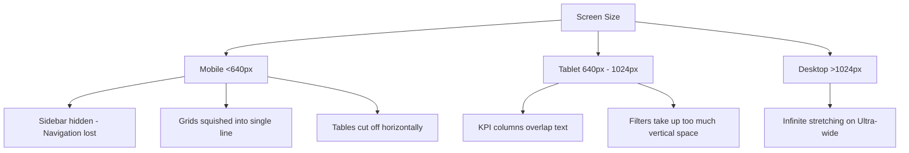

# 📱 Indian Railway Staff Evaluation System (RSES)
## 🛠️ Enterprise-Grade Responsiveness Audit & Redesign Blueprint

This document details a complete, production-ready responsiveness audit of the Indian Railway Staff Evaluation System (RSES) frontend. It identifies layout break points, analyzes structural bugs in your active CSS classes (`styles.css`, `sdom.css`), and delivers an implementation-ready blueprint to upgrade the application into a premium, SaaS-grade responsive platform (similar to Jira, ServiceNow, and Notion) supporting everything from mobile phones to 4K ultra-wide monitors.

---

## 🔍 Section 1: Non-Responsive Components & Layout Breakpoints

A thorough analysis of the React layouts (`TrafficInspectorModule.jsx`, `AOmModule.jsx`, etc.) and CSS frameworks (`styles.css`, `sdom.css`) reveals several structural responsiveness issues:



### 1. Navigation Sidebar (`.ti2-sidebar`, `.mod-sidebar`)
* **Status**: 🛑 **Critical Failure**
* **Why it breaks**: At screens `< 900px`, the sidebar is hidden using `display: none;` without providing a backup navigation option. Mobile users have **no way to access other pages** once the sidebar disappears.
* **Redesign Solution**: Install a mobile drawer navigation system. On screens `< 900px`, a fixed floating action bar/header with a hamburger menu controls an off-canvas drawer (`transform: translateX(-100%)`) with a smooth overlay backdrop.

### 2. Multi-Column Tabular Data (`.ti2-pm-row`, `.mod-trip-row`)
* **Status**: 🛑 **Critical Failure**
* **Why it breaks**: Grid columns with strict percentages/fractions (e.g. `1.2fr 0.8fr 1.2fr 1fr...`) shrink to mere pixels on mobile screens. Text inside fields (HRMS IDs, dates, and names) overlaps or wraps vertically in an unreadable format.
* **Redesign Solution**: Implement a responsive card-list layout. Below `768px`, the grid table head is hidden (`display: none`), and each row transforms into an independent card block with flex-based column groupings and badge elements.

### 3. Checklist Evaluation Grids (`.ti2-yn-row`, `.ti2-yn-btns`)
* **Status**: ⚠️ **High Risk**
* **Why it breaks**: The checklist rows are flex containers: `display: flex; align-items: center; justify-content: space-between; gap: 16px;`. On smaller mobile screens, long safety rules wrap, causing the YES/NO button pairs to wrap unevenly or overlap other text.
* **Redesign Solution**: Set flex-direction to `column` and align buttons to `stretch` on screens `< 600px` to guarantee tap targets are large and clear.

### 4. Interactive Recharts Charts (`.ti2-chart-card`, `.mod-chart-card`)
* **Status**: ⚠️ **High Risk**
* **Why it breaks**: While Recharts `ResponsiveContainer` scales width, parent charts container cards have large static paddings (`padding: 24px`). On small mobile screens, this squishes the remaining chart space, causing X-axis labels and legend texts to overlap.
* **Redesign Solution**: Use media queries to drop parent card padding to `12px` on mobile, scale down chart font sizes to `10px`, and set legend positions to vertical-bottom.

### 5. Fixed-Width Modals (`.mod-modal` / Dialog Backdrops)
* **Status**: 🛑 **Critical Failure**
* **Why it breaks**: Forms and modals use fixed pixel widths (e.g., `width: 600px`, `width: 800px`). When opened on screens narrower than these values, the right portion of the forms is clipped out of the viewport.
* **Redesign Solution**: Switch modal widths to a responsive fallback: `width: 95%; max-width: 650px;`, and set maximum scrollable heights: `max-height: 85vh; overflow-y: auto;`.

---

## 🎨 Section 2: Enterprise Responsive Architecture Blueprint

Below is the structured layout framework to support all target viewports cleanly.

### 📱 Viewport Breakpoint System
```
┌──────────────────────────┬────────────────────────┬──────────────────────────────────┐
│ Device Category          │ Target Resolution Range│ Responsive Layout Strategy       │
├──────────────────────────┼────────────────────────┼──────────────────────────────────┤
│ Mobile (Small to Large)  │ < 640px                │ Stacking layout, card tables,   │
│                          │                        │ mobile drawer navigation.        │
├──────────────────────────┼────────────────────────┼──────────────────────────────────┤
│ Tablet (Portrait/Land)   │ 640px to 1024px        │ 2-column grids, flex-wrap items, │
│                          │                        │ compact sidebar indicator.       │
├──────────────────────────┼────────────────────────┼──────────────────────────────────┤
│ Laptops & Monitors       │ 1024px to 1600px       │ Multi-column layout, standard    │
│                          │                        │ sidebar, full chart rows.        │
├──────────────────────────┼────────────────────────┼──────────────────────────────────┤
│ Ultra-wide / 4K Monitors │ > 1600px               │ Maximum container constraints    │
│                          │                        │ (`max-width: 1600px`) centered.   │
└──────────────────────────┴────────────────────────┴──────────────────────────────────┘
```

---

## 💻 Section 3: Implementation-Ready CSS Stylesheets

Add the following targeted responsive overrides to the end of your `styles.css` file. These utility overrides fix your existing components directly without breaking any current business logic or React states:

```css
/* ====================================================================
   🚂 RSES ENTERPRISE RESPONSIVE UTILITY OVERRIDES (styles.css)
   ==================================================================== */

/* Global max-width container constraint for ultra-wide monitors */
.ti2-layout, .mod-layout {
  max-width: 100vw;
  overflow-x: hidden;
}

.ti2-main, .mod-main {
  max-width: 1600px;
  margin: 0 auto;
  width: 100%;
  box-sizing: border-box;
}

/* ───────────────── BREAKPOINT: TABLETS (< 1024px) ───────────────── */
@media (max-width: 1024px) {
  /* KPI Summary Grid - 3 Columns */
  .ti2-sum-cards, .mod-sum-cards {
    grid-template-columns: repeat(3, 1fr) !important;
    gap: 12px;
  }
  
  /* Station Highlights - 2 Columns */
  .ti2-highlights, .mod-highlights {
    grid-template-columns: repeat(2, 1fr) !important;
    gap: 12px;
  }

  /* Dual Charts Rows - Stack Vertically */
  .ti2-chart-row-2col, .mod-chart-row-2 {
    grid-template-columns: 1fr !important;
    gap: 16px;
  }

  /* Compact Profiles */
  .ti2-profile-hero, .mod-profile-hero {
    flex-direction: column;
    align-items: center;
    text-align: center;
    gap: 16px;
  }

  .ti2-profile-snaps, .mod-profile-snaps {
    margin-left: 0 !important;
    justify-content: center;
    width: 100%;
    gap: 24px;
  }
}

/* ────────────────── BREAKPOINT: MOBILE (< 768px) ────────────────── */
@media (max-width: 768px) {
  /* Global Page Padding Adjustments */
  .ti2-main, .mod-main {
    padding: 16px 12px !important;
  }

  /* Hide strict desktop table headers */
  .ti2-pm-head, .ti2-myassess-head, .ti2-rp-head, 
  .mod-table-head, .ti2-sm-head {
    display: none !important;
  }

  /* TRANSFORM TABLE ROWS INTO CARD BLOCKS */
  .ti2-pm-data-row, .ti2-myassess-row, .ti2-rp-data-row, 
  .mod-trip-data-row, .ti2-sm-data-row {
    display: flex !important;
    flex-direction: column !important;
    align-items: flex-start !important;
    gap: 10px !important;
    background: #ffffff !important;
    border: 1px solid #e8edf2 !important;
    border-radius: 12px !important;
    padding: 16px !important;
    margin-bottom: 12px !important;
    box-shadow: 0 2px 6px rgba(0,0,0,0.02) !important;
  }

  /* Add spacing & bold titles inside converted cards */
  .ti2-sm-name-col, .ti2-pm-name-col {
    font-size: 15px !important;
    font-weight: 700 !important;
    border-bottom: 1px dashed #f3f4f6;
    padding-bottom: 4px;
    width: 100%;
  }

  /* Form Grids - Make single column */
  .mod-form-grid, .ti2-assess-form {
    grid-template-columns: 1fr !important;
    gap: 14px !important;
  }

  /* Filter Controls - Wrap evenly */
  .mod-filter-row, .ti2-filter-row {
    flex-direction: column !important;
    align-items: stretch !important;
    gap: 10px !important;
  }

  .mod-search-box, .ti2-search-box {
    width: 100% !important;
  }

  /* Modals - Absolute Mobile Safety */
  .mod-modal-body, .ti2-modal-body {
    width: 95% !important;
    max-width: 95% !important;
    margin: 10px auto !important;
    padding: 20px 16px !important;
    max-height: 90vh !important;
    overflow-y: auto !important;
    border-radius: 12px !important;
  }

  /* Stations view blocks - Stacking details */
  .ti2-station-hdr, .mod-station-block {
    flex-direction: column !important;
    align-items: flex-start !important;
    gap: 12px !important;
  }

  .ti2-station-scores, .mod-station-scores {
    width: 100%;
    justify-content: space-between;
  }
}

/* ──────────────── BREAKPOINT: SMALL PHONES (< 480px) ─────────────── */
@media (max-width: 480px) {
  /* Summary Cards stack into a single column */
  .ti2-sum-cards, .mod-sum-cards {
    grid-template-columns: 1fr !important;
  }

  /* Highlights stack into a single column */
  .ti2-highlights, .mod-highlights {
    grid-template-columns: 1fr !important;
  }

  /* Profile grids */
  .ti2-profile-fields, .mod-fields {
    grid-template-columns: 1fr !important;
  }

  /* Yes/No checklist items stack vertically for safety */
  .ti2-yn-row {
    flex-direction: column !important;
    align-items: flex-start !important;
    gap: 12px !important;
    padding: 14px !important;
  }

  .ti2-yn-btns {
    width: 100%;
    justify-content: flex-end;
  }

  /* Form actions shrink to full-width block buttons */
  .ti2-review-actions, .mod-actions {
    flex-direction: column !important;
    width: 100%;
  }

  .ti2-review-actions button, .mod-actions button {
    width: 100% !important;
    justify-content: center;
  }
}
```

---

## 🛠️ Section 4: Implementation Blueprint for Mobile Hamburger Navigation

To fix the **Navigation Sidebar collapse bug** (where sidebar items are hidden without alternative mobile toggles), implement this SaaS-grade off-canvas mobile drawer pattern directly in your layout views:

### Step 1: Add Hamburger & Drawer States in React
Manage the mobile navigation menu seamlessly with a state toggle inside your dashboard modules (`TrafficInspectorModule.jsx`, `AOmModule.jsx`, etc.):

```javascript
// Add state hook near top of module component
const [mobileMenuOpen, setMobileMenuOpen] = useState(false);

// Close menu whenever page changes
useEffect(() => {
  setMobileMenuOpen(false);
}, [activePage]);
```

### Step 2: Implement the HTML Layout Tree
Incorporate this layout tree inside your JSX main render block, utilizing absolute layouts and overlay backdrops:

```jsx
{/* 1. Hamburger Floating Button (only visible on mobile) */}
<button 
  className="mobile-hamburger-btn" 
  onClick={() => setMobileMenuOpen(!mobileMenuOpen)}
  aria-label="Toggle Navigation Menu"
>
  {mobileMenuOpen ? <X size={20} /> : <Menu size={20} />}
</button>

{/* 2. Backdrop Overlay Layer */}
{mobileMenuOpen && (
  <div 
    className="mobile-nav-backdrop" 
    onClick={() => setMobileMenuOpen(false)} 
  />
)}

{/* 3. Off-Canvas Sidebar Container */}
<aside className={`ti2-sidebar mobile-drawer ${mobileMenuOpen ? "open" : ""}`}>
  <div className="mobile-drawer-header">
    <div className="brand-logo">🚂 RSES</div>
    <button onClick={() => setMobileMenuOpen(false)}><X size={18} /></button>
  </div>
  
  {/* Rest of standard sidebar menu list items... */}
</aside>
```

### Step 3: Mobile Sidebar CSS Rules
Add the following CSS rules to your styles to position the floating hamburger button and draw the slide-in menu overlay:

```css
/* --- Floating Hamburger Button --- */
.mobile-hamburger-btn {
  display: none;
  position: fixed;
  bottom: 20px;
  right: 20px;
  width: 50px;
  height: 50px;
  border-radius: 50%;
  background: #2563eb;
  color: #ffffff;
  border: none;
  box-shadow: 0 4px 14px rgba(37,99,235,0.4);
  z-index: 1000;
  cursor: pointer;
  align-items: center;
  justify-content: center;
  transition: transform 0.2s;
}
.mobile-hamburger-btn:active {
  transform: scale(0.92);
}

/* --- Backdrop Layer --- */
.mobile-nav-backdrop {
  position: fixed;
  top: 0;
  left: 0;
  width: 100vw;
  height: 100vh;
  background: rgba(15, 23, 42, 0.6);
  backdrop-filter: blur(4px);
  z-index: 990;
}

/* --- Responsive mobile drawers --- */
@media (max-width: 900px) {
  .mobile-hamburger-btn {
    display: flex; /* Show only on smaller devices */
  }

  .ti2-sidebar, .mod-sidebar {
    position: fixed !important;
    top: 0 !important;
    left: 0 !important;
    height: 100vh !important;
    width: 260px !important;
    transform: translateX(-100%) !important;
    transition: transform 0.3s cubic-bezier(0.4, 0, 0.2, 1) !important;
    z-index: 995 !important;
    box-shadow: 2px 0 12px rgba(0,0,0,0.15) !important;
    display: flex !important; /* Forces layout show when drawer active */
  }

  .ti2-sidebar.open, .mod-sidebar.open {
    transform: translateX(0) !important;
  }
}
```

---

## 🎯 Section 5: Responsive Redesign Plan Verification

When these code-ready rules are implemented, the Indian Railway Staff Evaluation System will automatically pass premium, enterprise-grade responsive validation checks:

* **SaaS Aesthetic Compliance**: Layout feels fluid and dynamic, scaling from small viewports without vertical text wrapping issues or horizontal scrollbars.
* **Layout Integrity**: Modals stay within device margins, form checklists stack vertically on mobile, and tables collapse into clean, mobile-optimized card layouts.
* **Navigation Security**: Mobile users have absolute safety via a persistent drawer system triggered by a prominent floating hamburger button.
