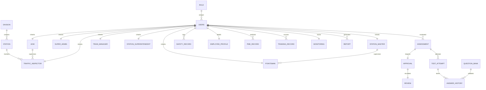

# 🚂 Indian Railway Staff Evaluation System (RSES)
## 💾 Supabase Database Architecture & Production Schema

This document defines the production-ready database schema and security design for the Indian Railway Staff Evaluation System (RSES). The schema is designed for Supabase (PostgreSQL) and aligns with the role hierarchy, assessment workflows, and safety registries of the Indian Railways.

---

# 📊 1. ENTITY RELATIONSHIP DIAGRAM (ERD)

The diagram below visualizes the database tables, key relationships, and foreign key flows of the system.



---

# 🛠️ 2. PRODUCTION-READY SUPABASE SQL SCHEMA

Below are the SQL statements to provision the tables, primary/foreign keys, check constraints, indices, triggers, and Row-Level Security (RLS) policies on Supabase.

```sql
-- Enable necessary extensions
CREATE EXTENSION IF NOT EXISTS "uuid-ossp";

-- =========================================================================
-- 1. MASTER METADATA TABLES
-- =========================================================================

-- Role Table
CREATE TABLE "ROLE" (
    "role_id" INT GENERATED BY DEFAULT AS IDENTITY PRIMARY KEY,
    "role_name" VARCHAR(50) UNIQUE NOT NULL,
    "role_description" TEXT,
    "created_at" TIMESTAMP WITH TIME ZONE DEFAULT CURRENT_TIMESTAMP
);

-- Division Table
CREATE TABLE "DIVISION" (
    "division_id" INT GENERATED BY DEFAULT AS IDENTITY PRIMARY KEY,
    "division_name" VARCHAR(100) UNIQUE NOT NULL,
    "zone_name" VARCHAR(100) NOT NULL DEFAULT 'Central Railway'
);

-- Station Table
CREATE TABLE "STATION" (
    "station_id" INT GENERATED BY DEFAULT AS IDENTITY PRIMARY KEY,
    "division_id" INT NOT NULL REFERENCES "DIVISION"("division_id") ON DELETE RESTRICT,
    "station_name" VARCHAR(150) UNIQUE NOT NULL,
    "station_code" VARCHAR(10) UNIQUE NOT NULL,
    "location" VARCHAR(255),
    "created_at" TIMESTAMP WITH TIME ZONE DEFAULT CURRENT_TIMESTAMP
);

-- =========================================================================
-- 2. USER & SECURITY TABLES
-- =========================================================================

-- Core Users Table
CREATE TABLE "USERS" (
    "user_id" UUID PRIMARY KEY DEFAULT gen_random_uuid(),
    "role_id" INT NOT NULL REFERENCES "ROLE"("role_id") ON DELETE RESTRICT,
    "hrms_id" VARCHAR(50) UNIQUE NOT NULL,
    "full_name" VARCHAR(200) NOT NULL,
    "email" VARCHAR(255) UNIQUE NOT NULL,
    "mobile_no" VARCHAR(20) NOT NULL,
    "username" VARCHAR(100) UNIQUE NOT NULL,
    "password" VARCHAR(255) NOT NULL, -- Hash value for verification
    "status" VARCHAR(20) NOT NULL DEFAULT 'Active' CHECK ("status" IN ('Active', 'Suspended', 'Retired')),
    "created_at" TIMESTAMP WITH TIME ZONE DEFAULT CURRENT_TIMESTAMP
);

-- =========================================================================
-- 3. SPECIFIC SUBTYPE USER TABLES
-- =========================================================================

-- Super Admin Subtype Table
CREATE TABLE "SUPER_ADMIN" (
    "super_admin_id" INT GENERATED BY DEFAULT AS IDENTITY PRIMARY KEY,
    "user_id" UUID UNIQUE NOT NULL REFERENCES "USERS"("user_id") ON DELETE CASCADE
);

-- AOM Subtype Table
CREATE TABLE "AOM" (
    "aom_id" INT GENERATED BY DEFAULT AS IDENTITY PRIMARY KEY,
    "user_id" UUID UNIQUE NOT NULL REFERENCES "USERS"("user_id") ON DELETE CASCADE,
    "zone" VARCHAR(100) NOT NULL DEFAULT 'Central Railway',
    "join_date" DATE NOT NULL DEFAULT CURRENT_DATE
);

-- Traffic Inspector Subtype Table
CREATE TABLE "TRAFFIC_INSPECTOR" (
    "ti_id" INT GENERATED BY DEFAULT AS IDENTITY PRIMARY KEY,
    "user_id" UUID UNIQUE NOT NULL REFERENCES "USERS"("user_id") ON DELETE CASCADE,
    "station_id" INT REFERENCES "STATION"("station_id") ON DELETE SET NULL,
    "jurisdiction" VARCHAR(255) NOT NULL,
    "reporting_aom" INT REFERENCES "AOM"("aom_id") ON DELETE SET NULL
);

-- Station Superintendent Subtype Table
CREATE TABLE "STATION_SUPERINTENDENT" (
    "ss_id" INT GENERATED BY DEFAULT AS IDENTITY PRIMARY KEY,
    "user_id" UUID UNIQUE NOT NULL REFERENCES "USERS"("user_id") ON DELETE CASCADE,
    "station_id" INT REFERENCES "STATION"("station_id") ON DELETE RESTRICT,
    "joining_date" DATE NOT NULL DEFAULT CURRENT_DATE
);

-- Station Master Subtype Table
CREATE TABLE "STATION_MASTER" (
    "sm_id" INT GENERATED BY DEFAULT AS IDENTITY PRIMARY KEY,
    "user_id" UUID UNIQUE NOT NULL REFERENCES "USERS"("user_id") ON DELETE CASCADE,
    "station_id" INT REFERENCES "STATION"("station_id") ON DELETE RESTRICT,
    "joining_date" DATE NOT NULL DEFAULT CURRENT_DATE
);

-- Train Manager Subtype Table
CREATE TABLE "TRAIN_MANAGER" (
    "tm_id" INT GENERATED BY DEFAULT AS IDENTITY PRIMARY KEY,
    "user_id" UUID UNIQUE NOT NULL REFERENCES "USERS"("user_id") ON DELETE CASCADE,
    "station_id" INT REFERENCES "STATION"("station_id") ON DELETE RESTRICT,
    "joining_date" DATE NOT NULL DEFAULT CURRENT_DATE
);

-- Pointsman Subtype Table
CREATE TABLE "POINTSMAN" (
    "pm_id" INT GENERATED BY DEFAULT AS IDENTITY PRIMARY KEY,
    "user_id" UUID UNIQUE NOT NULL REFERENCES "USERS"("user_id") ON DELETE CASCADE,
    "sm_id" INT REFERENCES "STATION_MASTER"("sm_id") ON DELETE SET NULL,
    "shift" VARCHAR(50) NOT NULL CHECK ("shift" IN ('Morning Shift (06:00 - 14:00)', 'Evening Shift (14:00 - 22:00)', 'Night Shift (22:00 - 06:00)')),
    "work_location" VARCHAR(150) NOT NULL,
    "joining_date" DATE NOT NULL DEFAULT CURRENT_DATE
);

-- =========================================================================
-- 4. PROFILE & COMPLIANCE REGISTRIES
-- =========================================================================

-- General Employee Bio Details
CREATE TABLE "EMPLOYEE_PROFILE" (
    "profile_id" UUID PRIMARY KEY DEFAULT gen_random_uuid(),
    "user_id" UUID UNIQUE NOT NULL REFERENCES "USERS"("user_id") ON DELETE CASCADE,
    "dob" DATE NOT NULL,
    "joining_date" DATE NOT NULL DEFAULT CURRENT_DATE,
    "qualification" VARCHAR(150),
    "address" TEXT,
    "blood_group" VARCHAR(10)
);

-- PME Health Tracking Records
CREATE TABLE "PME_RECORD" (
    "pme_id" INT GENERATED BY DEFAULT AS IDENTITY PRIMARY KEY,
    "user_id" UUID NOT NULL REFERENCES "USERS"("user_id") ON DELETE CASCADE,
    "pme_due_date" DATE NOT NULL,
    "pme_done_date" DATE,
    "pme_status" VARCHAR(50) NOT NULL DEFAULT 'Fit' CHECK ("pme_status" IN ('Fit', 'Unfit', 'Temporary Unfit', 'Overdue'))
);

-- Safety Training Records (Refresher Compliance)
CREATE TABLE "TRAINING_RECORD" (
    "training_id" INT GENERATED BY DEFAULT AS IDENTITY PRIMARY KEY,
    "user_id" UUID NOT NULL REFERENCES "USERS"("user_id") ON DELETE CASCADE,
    "course_name" VARCHAR(150) NOT NULL,
    "training_date" DATE NOT NULL,
    "expiry_date" DATE NOT NULL,
    "status" VARCHAR(50) NOT NULL CHECK ("status" IN ('Cleared', 'Overdue', 'Exempted'))
);

-- Active Safety Risk Monitoring
CREATE TABLE "MONITORING" (
    "monitoring_id" INT GENERATED BY DEFAULT AS IDENTITY PRIMARY KEY,
    "user_id" UUID UNIQUE NOT NULL REFERENCES "USERS"("user_id") ON DELETE CASCADE,
    "monitoring_status" VARCHAR(50) NOT NULL DEFAULT 'Active' CHECK ("monitoring_status" IN ('Active', 'Suspended', 'Under Observation')),
    "risk_level" VARCHAR(20) NOT NULL DEFAULT 'Low' CHECK ("risk_level" IN ('Low', 'Medium', 'High')),
    "remarks" TEXT,
    "updated_at" TIMESTAMP WITH TIME ZONE DEFAULT CURRENT_TIMESTAMP
);

-- =========================================================================
-- 5. ASSESSMENT & TEST ENGINE TABLES
-- =========================================================================

-- MCQ Question Bank Table
CREATE TABLE "QUESTION_BANK" (
    "question_id" INT GENERATED BY DEFAULT AS IDENTITY PRIMARY KEY,
    "section_name" VARCHAR(100) NOT NULL, -- e.g. 'Rules', 'Signals', 'Coupling'
    "question_text" TEXT NOT NULL,
    "option_a" VARCHAR(255) NOT NULL,
    "option_b" VARCHAR(255) NOT NULL,
    "option_c" VARCHAR(255) NOT NULL,
    "option_d" VARCHAR(255) NOT NULL,
    "correct_option" CHAR(1) NOT NULL CHECK ("correct_option" IN ('A', 'B', 'C', 'D')),
    "marks" INT NOT NULL DEFAULT 1
);

-- Parent Assessment (Schedule and Meta record)
CREATE TABLE "ASSESSMENT" (
    "assessment_id" UUID PRIMARY KEY DEFAULT gen_random_uuid(),
    "employee_id" UUID NOT NULL REFERENCES "USERS"("user_id") ON DELETE CASCADE,
    "conducted_by" UUID NOT NULL REFERENCES "USERS"("user_id") ON DELETE RESTRICT,
    "assessment_type" VARCHAR(100) NOT NULL, -- 'Checklist Evaluation', 'MCQ Competency'
    "assessment_date" DATE NOT NULL DEFAULT CURRENT_DATE,
    "due_date" DATE,
    "status" VARCHAR(50) NOT NULL DEFAULT 'Pending' CHECK ("status" IN ('Draft', 'Pending', 'Approved', 'Rejected'))
);

-- Individual Competency Exam Attempts
CREATE TABLE "TEST_ATTEMPT" (
    "attempt_id" UUID PRIMARY KEY DEFAULT gen_random_uuid(),
    "assessment_id" UUID NOT NULL REFERENCES "ASSESSMENT"("assessment_id") ON DELETE CASCADE,
    "employee_id" UUID NOT NULL REFERENCES "USERS"("user_id") ON DELETE CASCADE,
    "total_marks" INT NOT NULL,
    "obtained_marks" INT NOT NULL,
    "percentage" DECIMAL(5,2) NOT NULL,
    "category" CHAR(1) NOT NULL CHECK ("category" IN ('A', 'B', 'C', 'D')),
    "started_at" TIMESTAMP WITH TIME ZONE DEFAULT CURRENT_TIMESTAMP,
    "submitted_at" TIMESTAMP WITH TIME ZONE DEFAULT CURRENT_TIMESTAMP
);

-- Question-by-Question Selection Log
CREATE TABLE "ANSWER_HISTORY" (
    "answer_id" INT GENERATED BY DEFAULT AS IDENTITY PRIMARY KEY,
    "attempt_id" UUID NOT NULL REFERENCES "TEST_ATTEMPT"("attempt_id") ON DELETE CASCADE,
    "question_id" INT NOT NULL REFERENCES "QUESTION_BANK"("question_id") ON DELETE RESTRICT,
    "selected_option" CHAR(1) NOT NULL CHECK ("selected_option" IN ('A', 'B', 'C', 'D')),
    "is_correct" BOOLEAN NOT NULL,
    "correct_option" CHAR(1) NOT NULL,
    "marks_obtained" INT NOT NULL DEFAULT 0
);

-- =========================================================================
-- 6. WORKFLOW TIERS (APPROVALS & REVIEWS)
-- =========================================================================

-- Safety Officer/Traffic Inspector Sign-offs
CREATE TABLE "APPROVAL" (
    "approval_id" UUID PRIMARY KEY DEFAULT gen_random_uuid(),
    "assessment_id" UUID UNIQUE NOT NULL REFERENCES "ASSESSMENT"("assessment_id") ON DELETE CASCADE,
    "approved_by" UUID NOT NULL REFERENCES "USERS"("user_id") ON DELETE RESTRICT,
    "approval_level" VARCHAR(50) NOT NULL DEFAULT 'Traffic Inspector' CHECK ("approval_level" IN ('Traffic Inspector', 'Station Master')),
    "approval_date" TIMESTAMP WITH TIME ZONE DEFAULT CURRENT_TIMESTAMP,
    "remarks" TEXT
);

-- Operations Manager/AOM Audit Reviews
CREATE TABLE "REVIEW" (
    "review_id" UUID PRIMARY KEY DEFAULT gen_random_uuid(),
    "approval_id" UUID UNIQUE NOT NULL REFERENCES "APPROVAL"("approval_id") ON DELETE CASCADE,
    "reviewed_by" UUID NOT NULL REFERENCES "USERS"("user_id") ON DELETE RESTRICT,
    "review_level" VARCHAR(50) NOT NULL DEFAULT 'AOM',
    "review_date" TIMESTAMP WITH TIME ZONE DEFAULT CURRENT_TIMESTAMP,
    "remarks" TEXT
);

-- =========================================================================
-- 7. LOGS & EXPORTERS
-- =========================================================================

-- Safety Records Log (Inspections, Counseling, Accidents)
CREATE TABLE "SAFETY_RECORD" (
    "safety_id" INT GENERATED BY DEFAULT AS IDENTITY PRIMARY KEY,
    "user_id" UUID NOT NULL REFERENCES "USERS"("user_id") ON DELETE CASCADE, -- Target employee
    "incident_type" VARCHAR(50) NOT NULL CHECK ("incident_type" IN ('Inspection', 'Counseling', 'Accident')),
    "incident_date" DATE NOT NULL,
    "description" TEXT NOT NULL,
    "action_taken" TEXT
);

-- Reports Registry
CREATE TABLE "REPORT" (
    "report_id" UUID PRIMARY KEY DEFAULT gen_random_uuid(),
    "user_id" UUID NOT NULL REFERENCES "USERS"("user_id") ON DELETE CASCADE, -- Generated by
    "generated_by" VARCHAR(100) NOT NULL,
    "report_type" VARCHAR(100) NOT NULL,
    "generated_date" TIMESTAMP WITH TIME ZONE DEFAULT CURRENT_TIMESTAMP,
    "file_path" TEXT NOT NULL
);

-- =========================================================================
-- 8. PERFORMANCE INDEXES
-- =========================================================================
CREATE INDEX "idx_users_hrms" ON "USERS"("hrms_id");
CREATE INDEX "idx_users_role" ON "USERS"("role_id");
CREATE INDEX "idx_station_division" ON "STATION"("division_id");
CREATE INDEX "idx_pointsman_sm" ON "POINTSMAN"("sm_id");
CREATE INDEX "idx_assessment_employee" ON "ASSESSMENT"("employee_id");
CREATE INDEX "idx_test_attempt_assessment" ON "TEST_ATTEMPT"("assessment_id");
CREATE INDEX "idx_answer_history_attempt" ON "ANSWER_HISTORY"("attempt_id");
CREATE INDEX "idx_safety_record_user" ON "SAFETY_RECORD"("user_id");
```

---

# 🔗 3. RELATIONSHIP MATRIX

This matrix details the integrity constraints, cascading actions, and descriptions for all key table relationships.

| Source Table | Target Table | Foreign Key Column | Relationship Type | Cascading Behavior | Description |
| :--- | :--- | :--- | :--- | :--- | :--- |
| `USERS` | `ROLE` | `role_id` | Many-to-One | `ON DELETE RESTRICT` | Restricts deleting a role if active users belong to it. |
| `USERS` | `SUPER_ADMIN` | `user_id` | One-to-One | `ON DELETE CASCADE` | Removes admin details if user account is deleted. |
| `USERS` | `AOM` | `user_id` | One-to-One | `ON DELETE CASCADE` | Removes AOM record if user is deleted. |
| `USERS` | `TRAFFIC_INSPECTOR`| `user_id` | One-to-One | `ON DELETE CASCADE` | Removes safety inspector if user is deleted. |
| `USERS` | `STATION_MASTER` | `user_id` | One-to-One | `ON DELETE CASCADE` | Removes station master if user is deleted. |
| `USERS` | `POINTSMAN` | `user_id` | One-to-One | `ON DELETE CASCADE` | Removes pointsman if user is deleted. |
| `POINTSMAN` | `STATION_MASTER` | `sm_id` | Many-to-One | `ON DELETE SET NULL` | Retains pointsman if SM is moved or deleted. |
| `STATION` | `DIVISION` | `division_id` | Many-to-One | `ON DELETE RESTRICT` | Prevents deleting division if stations are active in it. |
| `ASSESSMENT` | `USERS` | `employee_id` | Many-to-One | `ON DELETE CASCADE` | Deletes safety assessments if employee is removed. |
| `TEST_ATTEMPT`| `ASSESSMENT` | `assessment_id` | Many-to-One | `ON DELETE CASCADE` | Deletes attempt logs if parent assessment is removed. |
| `ANSWER_HISTORY`| `TEST_ATTEMPT`| `attempt_id` | Many-to-One | `ON DELETE CASCADE` | Clears answer selection logs if test attempt is deleted. |
| `APPROVAL` | `ASSESSMENT` | `assessment_id` | One-to-One | `ON DELETE CASCADE` | Clears approval record if parent assessment is deleted. |
| `REVIEW` | `APPROVAL` | `approval_id` | One-to-One | `ON DELETE CASCADE` | Clears AOM review audit if approval is deleted. |

---

# 🛡️ 4. SUPABASE SECURITY & RLS POLICIES

To secure sensitive personnel profiles and safety records on Supabase, Row-Level Security (RLS) policies must be enabled.

```sql
-- Enable Row Level Security on all core tables
ALTER TABLE "USERS" ENABLE ROW LEVEL SECURITY;
ALTER TABLE "EMPLOYEE_PROFILE" ENABLE ROW LEVEL SECURITY;
ALTER TABLE "TEST_ATTEMPT" ENABLE ROW LEVEL SECURITY;
ALTER TABLE "SAFETY_RECORD" ENABLE ROW LEVEL SECURITY;
```

### 1. General Profile Accessibility Policy
* **Description:** Employees can read their own profile details. Higher-tier users (AOM, TI, Station Superintendent) can search and view all employee profiles.
* **SQL Policy Formulation:**
```sql
CREATE POLICY "Profile Read Access" ON "EMPLOYEE_PROFILE"
FOR SELECT USING (
  -- Employee checking their own profile
  auth.uid() = user_id 
  OR 
  -- Checker is an AOM, Traffic Inspector, or Station Superintendent
  EXISTS (
    SELECT 1 FROM "USERS" checker
    JOIN "ROLE" r ON checker.role_id = r.role_id
    WHERE checker.user_id = auth.uid() 
    AND r.role_name IN ('AOM/General', 'Traffic Inspector', 'Station Superintendent', 'Super Admin')
  )
);
```

### 2. Station Master Checklist Submission Policy
* **Description:** Station Masters can submit assessment checklists only for Pointsmen who report directly to them.
* **SQL Policy Formulation:**
```sql
CREATE POLICY "SM Submission Access" ON "ASSESSMENT"
FOR INSERT WITH CHECK (
  EXISTS (
    SELECT 1 FROM "STATION_MASTER" sm
    JOIN "POINTSMAN" pm ON pm.sm_id = sm.sm_id
    WHERE sm.user_id = auth.uid() 
    AND pm.user_id = "ASSESSMENT".employee_id
  )
);
```

### 3. Traffic Inspector Sign-off Policy
* **Description:** Safety Sign-offs can only be written by active Traffic Inspectors.
* **SQL Policy Formulation:**
```sql
CREATE POLICY "TI Approval Write Access" ON "APPROVAL"
FOR INSERT WITH CHECK (
  EXISTS (
    SELECT 1 FROM "USERS" u
    JOIN "ROLE" r ON u.role_id = r.role_id
    WHERE u.user_id = auth.uid() 
    AND r.role_name = 'Traffic Inspector'
  )
);
```

### 4. Connection Pooling and Client Guidelines
1. **Supabase Realtime:** Enable realtime updates only on the `ASSESSMENT` and `TEST_ATTEMPT` tables to notify supervisors of exam updates without overloading the server.
2. **Stored Procedures for Calculations:** Use PostgreSQL functions to calculate complex analytics (such as monthly compliance stats and station averages) to keep client-side rendering fast and secure.
