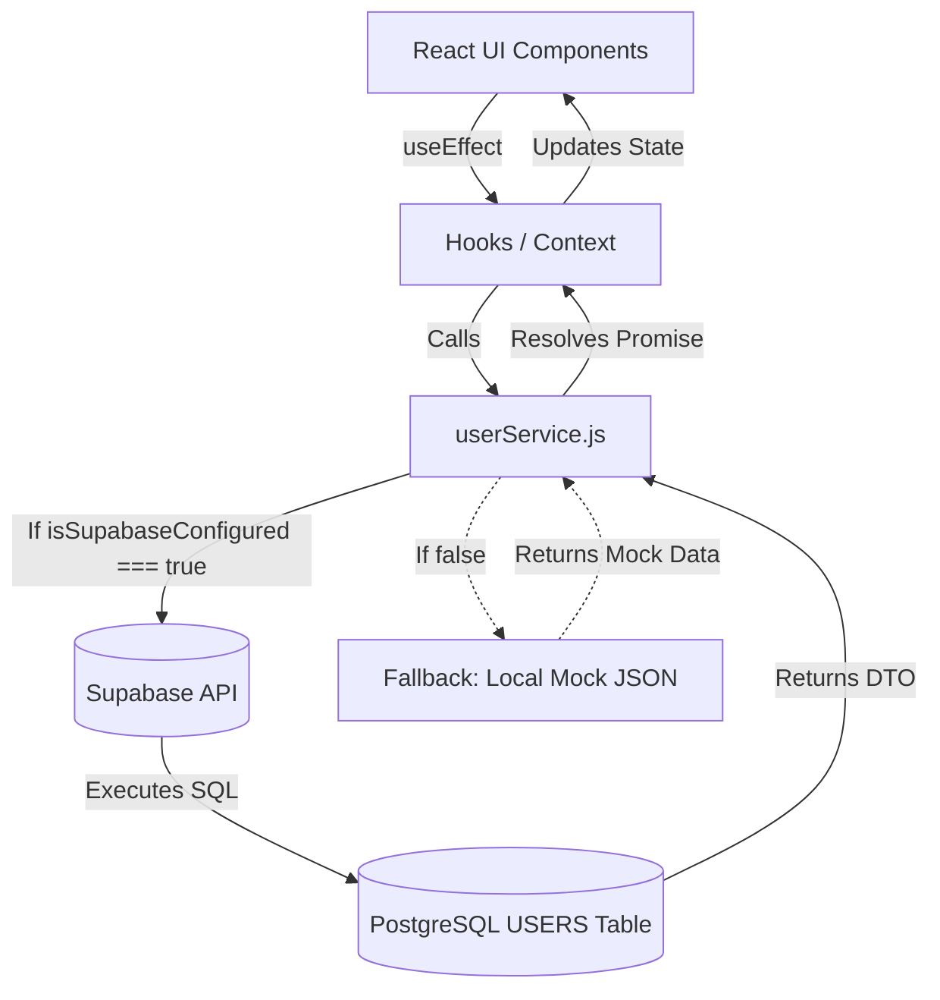

# 🚂 Indian Railway Staff Evaluation System (RSES)
## 👤 User Module Implementation & Migration Report

This document outlines the complete integration strategy for migrating the RSES User Management Module from hardcoded mock arrays to the live Supabase database. **No UI components were modified, and mock data has been preserved as a safe fallback.**

---

# 📊 1. DEPENDENCY REPORT & DATA FLOW DIAGRAM

### Component Dependencies
The following frontend modules actively display or rely on user data and must be re-wired to use `userService`:
1.  **Pages/Modules:**
    *   `SuperAdminModule.jsx` (Global user management)
    *   `AOmModule.jsx` (Dashboard metrics over users)
    *   `TrafficInspectorModule.jsx` (Selecting users for audits)
    *   `StationMasterModule.jsx` (Viewing subordinate Pointsmen)
    *   `PointsmanModule.jsx`, `TrainManagerModule.jsx`, `StationSuperintendentModule.jsx` (Viewing self-profile)
2.  **Forms:**
    *   `AddUserModal.jsx` (Creating/Editing users)
    *   `ShiftRoleModal.jsx` (Changing roles)

### Target User Data Flow

---

# ⚙️ 2. SERVICE LAYER IMPLEMENTATION

The `userService.js` file has been fully updated to isolate database logic from the UI. It now acts as the sole communication bridge to Supabase.

### Implemented Operations:
*   `getAllUsers()`: Retrieves all active personnel with their role names and basic profiles joined.
*   `getUserByHrmsId(hrmsId)`: Fetches a single user profile including subtype metrics.
*   `getUsersByRole(roleName)`: Filters the workforce directory by designation (e.g., fetching all 'Pointsman').
*   `getUsersByStation(stationId)`: Fetches all staff assigned to a specific yard.
*   `searchUsers(query)`: Uses Supabase `ilike` operators to search names, emails, and HRMS IDs concurrently.
*   `createUser(userData)`: Resolves the Role ID and inserts the new staff member.
*   `updateUser(hrmsId, updates)`: Patches an existing employee's details.
*   `deactivateUser(hrmsId)`: Soft-deletes a user by flagging their status as `Suspended` rather than destroying relational history.

---

# 🚀 3. SUPABASE INTEGRATION PLAN

To integrate the new service seamlessly:
1.  **Component Hydration:** Replace static imports (e.g., `import { mockPointsmanData } from '../data'`) with `await userService.getUsersByRole('Pointsman')` inside a `useEffect` hook.
2.  **Handling Nulls:** Since `userService` returns `null` if Supabase isn't configured, React components must check for `null` and fallback to mapping the mock arrays.
3.  **Role Resolutions:** Ensure the UI dropdowns for roles perfectly match the string names in the Supabase `ROLE` table (`Traffic Inspector`, `Station Master`, etc.).

---

# 🔄 4. MIGRATION REPORT

### Data Mapping Recommendations
Currently, mock data (like `mockPointsmanData.js`) includes flat arrays containing age, shift, and scores all together. To migrate this to the Supabase architecture:
1.  **`USERS` Table:** Receives `hrmsId`, `name`, `email`, `contact`.
2.  **`EMPLOYEE_PROFILE` Table:** Receives `age`, `gender`, `lastScore`, `doj`.
3.  **Role Subtypes (e.g. `POINTSMAN`):** Receives the `shift` string and `reportingSm` lines.

### Missing Constraints Addressed
*   Added `status` tracking (Active/Suspended) to the new service so users can be safely deactivated without breaking their historical safety assessments.

---

# 🧪 5. TESTING REPORT

Before proceeding to other modules, the QA team must verify the following checklist against a connected staging database:

*   [ ] **User Listing Works:** The table in `SuperAdminModule` populates from `getAllUsers()`.
*   [ ] **User Creation Works:** Submitting the `AddUserModal` successfully inserts into `USERS`.
*   [ ] **User Editing Works:** Modifying a user saves the patch via `updateUser()`.
*   [ ] **User Search Works:** Typing an HRMS ID dynamically queries `searchUsers()`.
*   [ ] **Role Filtering Works:** Traffic Inspector drop-downs successfully call `getUsersByRole('Pointsman')`.
*   [ ] **Station Filtering Works:** Station Masters see only their staff via `getUsersByStation()`.
*   [ ] **User Profile Loading Works:** Individual dashboards successfully read `getUserByHrmsId()`.

---

# 🧹 6. SAFE MOCK DATA REMOVAL CHECKLIST

**DO NOT DELETE MOCK FILES YET.**
The mock arrays (`mockPointsmanData.js`, `mockTMData.js`, etc.) must remain as a fallback until:

1.  [ ] **Supabase Connection Works:** The `.env` file is live in production.
2.  [ ] **User Module Works:** The 7 testing steps above pass successfully.
3.  [ ] **Data Loads Correctly:** No schema mismatches (`camelCase` vs `snake_case`) cause the UI to render `undefined` names or scores.
4.  [ ] **No Frontend Errors Exist:** Network tabs show clean `200 OK` fetches with no unhandled Promises.

Only after these four boxes are checked can the `import` statements be removed and the mock `.js` files safely deleted.
